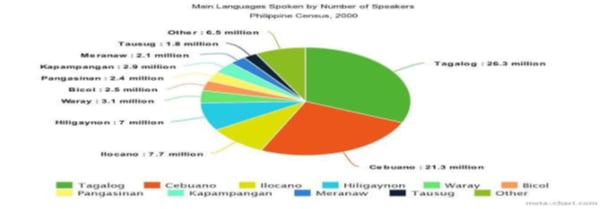
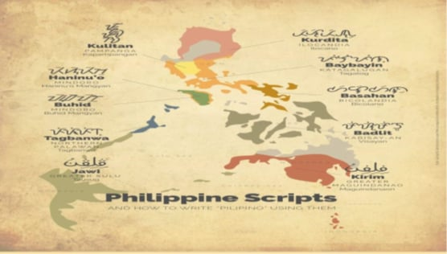
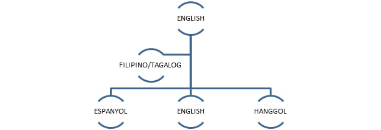
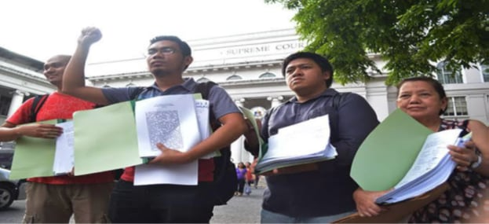
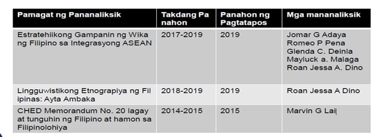
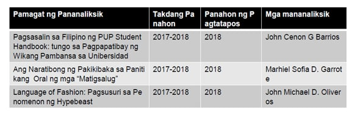
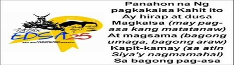
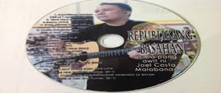
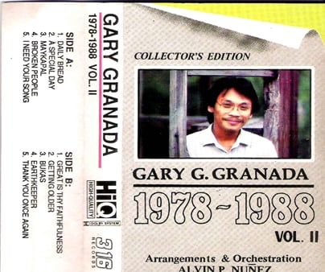
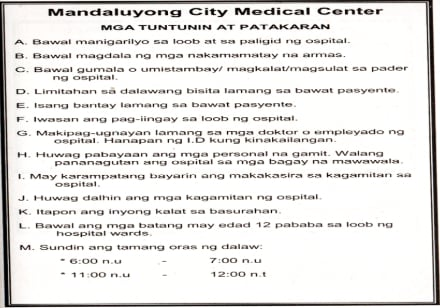

<!DOCTYPE html>
<html lang="en">
<head>
    <meta charset="UTF-8">
    <meta name="viewport" content="width=device-width, initial-scale=1.0">
    <title>EduProLMS - Nova Theme</title>
    <link rel="preconnect" href="https://fonts.googleapis.com">
    <link rel="preconnect" href="https://fonts.gstatic.com" crossorigin>
    <link href="https://fonts.googleapis.com/css2?family=Inter:wght@300;400;500;600;700&display=swap" rel="stylesheet">
    
</head>
<body>
    <header>
        

            
Educational LMS

            

                <a href="#" id="home-link">Home</a>
                <a href="#" id="login-link">Login</a>
                <a href="#" id="logout-link" style="display: none;">Logout</a>
            

        

    </header>

    <main>
        

            

            

                

                    <h1>Learning Management System [FILDIS]</h1>
                    
Welcome to EduProLMS. Access your courses, track your progress, and connect with fellow learners and educators in an innovative learning environment.

                    <a href="#" id="home-login-cta" class="cta-button">Get Started / Login</a>
                

                

                    <h2>Project Team</h2>
                    <ul>
                        <li>Brioso, Patrick Jimuel</li>
                        <li>Tenorio, Emmanuel Robet C.</li>
                        <li>Montefalco, Christian Paul</li>
                        <li>Maestro, Andrea Mirabete</li>
                        <li>Tadaya, Sean Louie</li>
                    </ul>
                

            

            

                <h2>Login to Your Account</h2>
                <form id="login-form">
                    

                        <label for="login-username">Username</label>
                        <input type="text" id="login-username" required placeholder="Enter your username">
                    

                    

                        <label for="login-password">Password</label>
                        <input type="password" id="login-password" required placeholder="Enter your password">
                    

                    <button type="submit">Login</button>
                </form>
            

            

                

                    <h2>Welcome, !</h2>
                    
Your Student Dashboard - Explore Your Modules

                

                <h3>Enrolled Modules</h3>
                

            

            

                

                    <h2>Welcome, !</h2>
                    
Your Teacher Dashboard - Manage & Create

                

                

                    <button class="tab-button active" data-tab="modules">Manage Modules</button>
                    <button class="tab-button" data-tab="students">Manage Students</button>
                    <button class="tab-button" data-tab="register-student">Register New Student</button>
                

                

                    <h3>Course Modules Overview</h3>
                    

                

                

                    <h3>Student Roster</h3>
                    <table class="student-list">
                        <thead>
                            <tr>
                                <th>Username</th>
                                <th>Date Registered</th>
                                <th>Actions</th>
                            </tr>
                        </thead>
                        <tbody id="student-list-body"></tbody>
                    </table>
                

                

                    <h3>Register a New Student</h3>
                     

                        <form id="register-student-form" style="box-shadow: none; padding:0;">
                            

                                <label for="new-student-username">Username</label>
                                <input type="text" id="new-student-username" required placeholder="Student's username">
                            

                            

                                <label for="new-student-password">Password</label>
                                <input type="password" id="new-student-password" required placeholder="Temporary password">
                            

                            

                                <label for="new-student-confirm-password">Confirm Password</label>
                                <input type="password" id="new-student-confirm-password" required placeholder="Confirm password">
                            

                            <button type="submit">Register Student</button>
                        </form>
                    

                

            

            

                <button id="back-to-dashboard-button"> ← Back to Dashboard</button>
                <h2 id="module-view-title">Module Title</h2>
                

                    <!-- Module content will be injected here -->
                

            

        

    </main>

    <button id="scroll-to-top" title="Go to top">↑</button>

    <footer>
        

            
© 2025 Educational Learning. All rights reserved. Innovating Education Together.

        

    </footer>

    <script>
const users = [
            {
                username: 'Leila',
                password: 'password123',
                role: 'teacher',
                dateRegistered: '2025-05-15'
            },
            {
                username: 'student',
                password: 'password123',
                role: 'student',
                dateRegistered: '2025-05-16'
            }
        ];

        let modulesData = [
                        {
                id: 'week1_filipino_pambansa',
                title: 'WEEK 1: Ang Filipino Bilang Wikang Pambansa',
                category: 'language', 
                description: 'Pagtalakay sa Filipino bilang pambansang wika, kasaysayan, epekto ng multilinggwalismo, at ang Mother-Tongue-Based Multilingual Education.',
                icon: '🇵🇭', 
                content: `
                    
<em>FILDIS: FILIPINO SA IBAT-IBANG DISIPLINA</em>

                    <h4>ANG FILIPINO BILANG WIKANG PAMBANSA</h4>
                    
Batay sa awitin na inawit kanina, ano ang kinalaman nito sa pagkakaroon ng maraming wika sa bansang Pilipinas? Ayon kay Roberto T. Anonuevo, Direktor –Heneral ng Komisyon sa Wikang Filipino (2018) Napatunayan ng (wikang) Filipino na kaya itong tanggapin sa iba't ibang rehiyon at gawing katuwang ng wika ng rehiyon dahil ang komposisyon ng Filipino ay hindi nalalayo sa naturang wika. Ayon kay Dr. Ernesto Constantino at Pamela Constantino mayroong 100 wika sa Pilipinas.

                    
                    
(Ang larawan na ito ay kinuha sa google.com)

                    
Makikita sa Grap ang mga pursyento o dami ng tao na nagsasalita sa wikang kanilang kinasanayan, ang mga Wika na nasa Grap at ang Sampung (10) ng wika sa Pilipinas na ginagamit ng nakararaming mamamayan.

                    
Batay naman kay Lorenzo Hueves y Panduro (1784) bago pa ang kolonyalisasyon ay pamilya ng malayo-polinesyo ang wikang Filipino. Sa Pananaliksik nina Constantino at Wilhelm Schmidt (1899) na Awstronesyan ang pamilya ng wika ng kinabibilangan ng mga wika sa Pilipinas.

                    
                    
                    
(Ang larawan ay kinuha sa Google)

                    
Sa larawan, ang mga sinaunang paraan ng pagsulat sa iba't ibang probinsiya ng Pilipinas. Kung mapapansin ninyo magkakamukha ang mga paraan nila ng pagsulat. Katunayan ito na maraming naging kamag-anak ang mga wika sa Filipinas tungo sa ibang bansa.

                    
                    <h5>Pagpasok ng Ibang wikang Kolonyal sa Pilipinas</h5>
                    
                    
Makikita sa Grap kung paano nakulong ang wikang Filipino sa wika ng ibang bayan batay kung sa paano ito namulaklak sa kultura at wikang Filipino, ang pagiging Multilingguwal ng Pilipinas ay naging instrumento upang magkaroon ng adaptasyon ang wika ng ibang bayan sa wikang Filipino.

                    
                    <h5>4.2 Makilala ang mga bansang Multilingual din ang gamit sa Edukasyon</h5>
                    <h6>Mga bansang Multilingual</h6>
                    <ul>
                        <li><b>ARUBA:</b> Isa sa mga bansang bumubuo ng kaharian ng Netherlands at malapit sa Venezuela. Wika: Papianmento. Wikang Umusbong mula sa Portuges, Kastila, Dutch at Ingles.</li>
                        <li><b>East Timor (Timor-Leste):</b> Wika: Tetum. May kabisahan din sa wikang Portuges at Ingles.</li>
                        <li><b>India:</b> Wika: Hindi at English ang opisyal na wika.</li>
                        <li><b>Luxembourg:</b> Luxembourish ang wika ng maliit na bansa (Hiram na salita mula sa salitang Pranses ang Luxembourish).</li>
                        <li><b>MALAYSIA:</b> Wika: Malay (opisyal na wika). Malay at English ang parehong ginagamit sa panturo. Mandarin (tinuturo sa mga may lahing Tsino).</li>
                        <li><b>Mauritius:</b> Bansang tinuturing na bahagi ng Africa. Wika: English at Pranses (wika ng paaralan). Mauritian Creole (Wikang umusbong sa Pranses ngunit hindi naiintindihan ng mga Pranses).</li>
                        <li><b>Singapore:</b> Wika: Mandarin Chinese, Malay at Tamil (opisyal na wika ng Singapore). English (Lingua Franca).</li>
                        <li><b>South Africa:</b> Labing isa (11) ang opisyal na wika. English (Lingua Franca). Afrikaans (wikang gamit sa kanlurang kontinente).</li>
                        <li><b>Suriname:</b> Hilagang America. Wika: Dutch (Paaralan, kalakaran at midya). Sranan Tongo (Sranan) (wika na may impluwensyang Dutch).</li>
                    </ul>

                    <h5>1.3 Maunawaan ang Mother-Tongue-Based Multilingual Education</h5>
                    <h6>Hamon ng Mother-Tongue-Based Multilingual Education</h6>
                    
Habang nililinang at pinauunlad ang Filipino, nang naluklok na Pansamantalang Punong Komisyoner ng KWF si Dr. Ricardo Ma. Duran Nolasco ay naging direksiyon ng ahensiya ang pagtangkilik sa multilingguwalismo. Katuwang ang Kongresista o Representatibo na si Kgg. Magtanggol Gunigundo ng Valenzuela. Ang Orihinal na House Bill Blg. 4719 na humihikayat na ipagamit ang unang wika ay isinumite sa Senado noong 2008. Ang paksa ay ang pagpapagamit sa unang wikang bilang midyum ng pagtuturo sa mga basikong edukasyon. Kinatigan ito ng Kagawaran ng Edukasyon (DepEd) sa pamamagitan ng paglalabas ng Ordinansa Blg. 74 na nagtatalakay sa pagsasainstitusyon ng paggamit ng unang wika ng mga mag-aaral.

                    
Napakalaki ng naging epekto ng pagsasakatuparan ng Mother-Tongue-Based Multilingual Education o MTB-MLE. Isa ito sa mga naging bagong direksyon sa pag-iimplementa ng K to 12.

                `
            },
            {
                id: 'week2_wika_akademya',
                title: 'WEEK 2: Wikang Filipino sa Bayan at Akademya',
                category: 'language',
                description: 'Ang papel ng Wikang Filipino sa pang-araw-araw na buhay at sa larangan ng akademiya, kasama ang mga hamon nito.',
                icon: '🎓',
                content: `
                    
Ayon kay G. Eugene Y. Evasco ang anomang wika sa daigdig tulad ng wikang Filipino, ay nalilikha, nililinang, pinagyayaman at hindi lamang basta isinilang. Kaya naman masasabi ring ang wika ay may kakayahang makiangkop sa pagbabagong nagaganap sa lipunang kayang pinagsisilbihan.

                    
Malinaw na pinapahayag ni E. Evasco ang kalakasan ng wika pagdating sa usapin ng paggamit dito sa umiiral na buhay ng isang Bansa.

                    
Sa Panahon ni dating pangulong Gloria Makapagal-Arroyo ginawa ang Pang-ehekutibo (E.O) 210 na nag-aanyas na ibalik ang Ingles bilang wikang panturo sa bansa. Nilimitahan ang paggamit ng wikang Filipino at itinakda nalamang ito bilang wikang panturo sa mga asignaturang Filipino at araling Panlipunan. Sinusugan pa ito ng kongreso nang ipasa ang House Bill 4701 "Act Prescribing English as Medium of Instruction in the Philippines School".

                    
Taliwas ito sa mga obsebasyon ng mga kritiko. Pinatunayan ito ng pag-aaral ng UNITED NATION (UN). Ayon sa United Nation (UN): "The Organization is fully aware of the crucial importance of languages when seen against the many challenges that humanity will have to face over the next few decades. Languages are indeed essential to the identity of group and individual and to their peaceful coexistence."

                    <h4>4.2 Makapagpahayag ng mga makabuluhang kaisipan sa pamamagitan ng tradisyonal at modernong midya</h4>
                    
Marami ang nanatiling buo ang paniniwala na ang mga umiiral na wika sa Pilipinas ay ang sagot sa mga suliranin ng Pambansang Edukasyon. Ayon kay Dr. David San Juan ng konvinor ng Tanggol Wika at dalubguro sa Pamantasan ng De La Salle, ang Wikang Pambansa ang tanging wika ng mga kilusang panlipunan.

                    <h5>Ang Pagsilang ng Tanggol Wika</h5>
                    
Sa inilabas na Memo ng CHED na CMO #20, Serye ng 2013 tahasang inaalis ang mga asignaturang sa wika, agham panlipunan at kasaysayan sa antas ng tersyaryo.

                    
                    
Dr. David San Juan (Dalubguro ng Pamantasang De La Salle University. (Ang larawan ay kinuha sa Google.com))

                    
Matapos ilabas ang CMO #20, serye ng 2013 nagkaroon ng protesta at pagkilos napinangunahan ng Tanggol Wika o mga Tagapag tanggol sa wika na pinangungunahan ni Dr. Davin San Juan ng De La Salle University. Naglabas si Dr. David San Juan ng isang Papel na may Pamagat na Alyansa ng Mga Tagapagtanggol bg Wikang Filipino/TANGGOL WIKA Internal na kwento, Mga Susing Argumento at Dokumento (2-14-2017)

                    <ul>
                        <li><b>ARGUMENTO 1:</b> WALANG MAKABULUHANG ARGUMENTO ANG MGA ANTI-FILIPINO – ANG KAMPONG TANGGAL WIKA – SA PAGPAPATANGGAL NG FILIPINO AT PANITIKAN</li>
                        <li><b>ARGUMENTO 2:</b> DAPAT MAY FILIPINO AT PANITIKAN SA KOLEHIYO DAHIL ANG IBANG ASIGNATURA NA NASA JUNIOR AT/O SENIOR HIGH SCHOOL AY MAY KATUMBAS PA RIN SA KOLEHIYO</li>
                        <li><b>ARGUMENTO 3:</b> ANG FILIPINO AY DISIPLINA, ASIGNATURA, BUKOD NA LARANGAN NG PAG-AARAL, AT HINDI SIMPLENG WIKANG PANTURO LAMANG</li>
                        <li><b>ARGUMENTO 4:</b> PARA MAGING EPEKTIBONG WIKANG PANTURO ANG FILIPINO, KAILANGANG ITURO AT LINANGIN DIN ITO BILANG ASIGNATURA</li>
                        <li><b>ARGUMENTO 5:</b> BAHAGI NG COLLEGE READINESS STANDARDS ANG FILIPINO AT PANITIKAN</li>
                        <li><b>ARGUMENTO 6:</b> SA IBANG BANSA, MAY ESPASYO RIN SA KURIKULUM ANG SARILING WIKA BILANG ASIGNATURA, BUKOD PA SA PAGIGING WIKANG PANTURO NITO</li>
                        <li><b>ARGUMENTO 7:</b> BINIGYAN NG DEPED AT CHED NG ESPASYO ANG MGA WIKANG DAYUHAN SA KURIKULUM, KAYA LALONG DAPAT NA MAY ESPASYO PARA SA WIKANG PAMBANSA</li>
                        <li><b>ARGUMENTO 8:</b> PINAG-AARALAN DIN SA IBANG BANSA ANG FILIPINO – AT MAY POTENSYAL ITONG MAGING ISANG NANGUNGUNANG WIKANG GLOBAL – KAYA LALONG DAPAT ITONG PAG-ARALAN SA PILIPINAS</li>
                        <li><b>ARGUMENTO 9:</b> MALAPIT ANG FILIPINO SA BAHASA MELAYU, BAHASA INDONESIA, AT BRUNEI MALAY, MGA WIKANG GINAGAMIT SA MALAYSIA, SINGAPORE, INDONESIA, AT BRUNEI, NA MGA BANSANG KASAPI NG ASEAN, KAYA'T MAHALAGANG WIKA ITO SA KONTEKSTO MISMO NG ASEAN INTEGRATION</li>
                        <li><b>ARGUMENTO 10:</b> MABABA PA RIN ANG AVERAGE SCORE NG MGA ESTUDYANTE SA FILIPINO SA NATIONAL ACHIEVEMENT TEST (NAT)</li>
                        <li><b>ARGUMENTO 11:</b> FILIPINO ANG WIKA NG MAYORYA, NG MIDYA, AT NG MGA KILUSANG PANLIPUNAN: ANG WIKA SA DEMOKRATIKO AT MAPAGPALAYANG DOMEYN NA MAHALAGA SA PAGBABAGONG PANLIPUNAN</li>
                    </ul>
                    <h5>Panunuri sa Kahalagahan ng Wikang Filipino</h5>
                    
Ayon kay Bienvenido Lumbera Sa pagtanggap natin sa wika, pumapaloob tayo sa isang lipunan at nakikiisa sa mga taong naroon. Samakatuwid ang kamalayan natin bilang indibiduwal at karugtong ng kamalayan ng iba sa lipunan. Kapag may kapanguarihang sumakop sa kamalayan ng kapwa natin sa lipunan, kasama tayong napapasailalim sa nasabing kapangyarihan.

                `
            },
            {
                id: 'week3_filipino_saliksik',
                title: 'WEEK 3: Filipino Bilang Wika ng Saliksik',
                category: 'research',
                description: 'Pagsusuri sa gamit ng Filipino sa iba\'t ibang larangan ng pananaliksik, agham, negosyo, edukasyon, at politika.',
                icon: '🔬',
                content: `
                    <h4>I. PANIMULA</h4>
                    
-Maisapraktika at mapaunlad pa ang mga batayang kasanayan sa pananaliksik

                    <h4>FILIPINO BILANG WIKA NG SALIKSIK SA IBA'T IBANG LARANG</h4>
                    
Sa pagtalakay sa Filipino bilang wika ng saliksik, hindi maisasantabi ang pagtalakay sa intektwalisasyon ng Filipino. Iniaangat ng bayan ang antas ng wika sa estado nagagamit ito sa intelekwal na usapin at intelektwal na materyales o babasahin.

                    
Kinikilala ang pananaliksik bilang refleksiyon ng talino at husay ng mananaliksik, matagal nang nakasusulat ng pananaliksik sa Filipino ang mga Pilipino lalo na ang mga nakapagdalubhasa sa Filipino.

                    
Marami nang mga aklat sa matematika at Agham ang tinangkang isulat sa Filipino. May mga aklat pangmedisina o pangkalusugan ang naisulat sa Filipino.

                    <h5>Pananaliksik sa Agham at teknolohiya</h5>
                    
Marahil kung walag pananaliksik ay atrasado pa rin ang ating pamumuhay sa kasalukuyan. Ang mga kagamitang pantahanan ay mas higit na nagpapadali sa mga gawain ng bawat miyembro ng pamilya. Higit na nagkakaroon ng mabilis na komunikasyon ang bawat isa kahit na nasa malayong distansya bunga ng pagkakatuklas ng mga cellphone.

                    <h5>Pananaliksik sa Negosyo at Industriya</h5>
                    
Ang pagpapatupaf ng mga kapasyahan sa isang negosyo ay batay na rin sa resulta ng maingat na pagpaplano at pagsusuri kung aling pananaliksik ang higit na angkop sa lalong ikaangat ng negosyo.

                    <h5>Pananaliksik sa Edukasyon</h5>
                    
Higit sa lahat mahalaga ang pananaliksik sa larangan ng edukasyon. Mahalaga makapagtatag ng matibay na pundasyon ng karunungan sa isip ng mga mag-aaral sa pamamagitan ng pagtuklas ng mga pamamaraang lalong makapagpapaunawa sa mga mag-aaral ng kanilang lektura. Ang inobasyon sa pasilidad at kagamitang panturo ay nakasalalay din sa gagawing pagtuklas sa pananaliksik ng mga implikasyon nnito sa larangang akademiko.

                    <h5>Pananaliksik sa Politika</h5>
                    
Dito higit na kailangan ng maingat na pag-aaral at pag-iimbestiga sa larangang ito ay walang hanggang ang pagtuklas ng mga kaparaanan sa nagpapatatag ng ekonomiya at kalagayang pampulitika sa bansa. Sa papanaw ng mga ekonomista ang pagkakaroon ng matatag na ekonomiya at maaring maging daan sa pagsasaayos ng kalagayan ng pampulitika ng bansa.

                    <h4>4.2 Makapagbasa at makapagbuod ng impormasyon, estadistika, datos atbp. mula sa mga babasahing nakasulat sa Filipino sa iba't ibang larangan</h4>
                    <h5>Pananaliksik ng mga Guro</h5>
                    
Ang mga sumusunod na halimbawa ng pananaliksik ng mga Guro ay ilan lamang sa mga gawa ng Guro. (Nasa Libro ng Filipino sa Iba't ibang disiplina ang iba pang halimbawa Pahina 50-63)

                    
                    
<i>Halimbawa: Estratehiikong Gampanin ng Wika ng Filipino sa Integrasyong ASEAN (Jomar G Adaya, Romeo P Pena, Glenda C. Deinla, Mayluck a. Malaga, Roan Jessa A. Dino)</i>

                    <h5>Pananaliksik ng mga mag-aaral</h5>
                    
Ang mga sumusunod na halimbawa ng pananaliksik ng mga Guro ay ilan lamang sa mga gawa ng mag-aaral. (Nasa Libro ng Filipino sa Iba't ibang disiplina ang iba pang halimbawa Pahina 63-69)

                    
                    
<i>Halimbawa: Pagsasalin sa Filipino ng PUP Student Handbook: tungo sa Pagpapatibay ng Wikang Pambansa sa Unibersidad (John Cenon G Barrios)</i>

                    
(Nasa Libro ng Filipino sa Iba't ibang disiplina ang iba pang halimbawa Pahina 50-69)

                `
            },
                       {
                id: 'week4_terminong_ingles_at_social_media', // Combined ID for Week 4
                title: 'WEEK 4: Mga Terminolohiyang Ingles Isinalin sa Filipino at mga Salita Mula sa Social Media',
                category: 'language',
                icon: '🔄📱',
                description: 'Pagsusuri sa pagsasalin ng mga terminong Ingles sa iba\'t ibang larangan patungong Filipino, at pagtalakay sa mga salitang umusbong mula sa Social Media.',
                content: `
                    
<em>FILDIS: FILIPINO SA IBAT-IBANG DISIPLINA</em>

                    <h4>MGA TERMINONG INGLES MULA SA IBA’T IBANG LARANGAN ISINALIN SA FILIPINO</h4>
                    
Isa sa mga dapat gawin upang makapanaliksik sa Filipino ay ang bigyang-malasakit ang mga teminong Ingles para sa iba’t ibang larangan na isinalin sa Filipino. Narito ang ilang halimbawa ng mungkahing termino.

                    <h5>A. Mga Katawagan sa Edukasyong Panteknolohiya at Pangkabuhayan</h5>
                    <table class="simple-table" style="width:100%; border-collapse: collapse; margin-bottom:20px;">
                        <thead><tr><th style="border:1px solid #ddd; padding:8px; text-align:left;">Termino</th><th style="border:1px solid #ddd; padding:8px; text-align:left;">Katumbas sa Filipino</th></tr></thead>
                        <tbody>
                            <tr><td style="border:1px solid #ddd; padding:8px;">Accountant</td><td style="border:1px solid #ddd; padding:8px;">Tagatuos</td></tr>
                            <tr><td style="border:1px solid #ddd; padding:8px;">Anatomy</td><td style="border:1px solid #ddd; padding:8px;">Anatomiya</td></tr>
                            <tr><td style="border:1px solid #ddd; padding:8px;">Arc</td><td style="border:1px solid #ddd; padding:8px;">Arko</td></tr>
                            <tr><td style="border:1px solid #ddd; padding:8px;">Athlete’s Foot</td><td style="border:1px solid #ddd; padding:8px;">Alipunga</td></tr>
                            <tr><td style="border:1px solid #ddd; padding:8px;">Auditor</td><td style="border:1px solid #ddd; padding:8px;">Tagasuri</td></tr>
                            <tr><td style="border:1px solid #ddd; padding:8px;">Bacteriology</td><td style="border:1px solid #ddd; padding:8px;">Baktirilohiya</td></tr>
                            <tr><td style="border:1px solid #ddd; padding:8px;">Body</td><td style="border:1px solid #ddd; padding:8px;">Kaha/katawan</td></tr>
                        </tbody>
                    </table>
                    
(Nasa librong Filipino sa Iba’t ibang disiplina ang nilalaman ng buong halimbawa pahina 70-81)

                    <h5>A. Mga Katawagan sa Pagbobrodkas (Broadcasting)</h5>
                    <table class="simple-table" style="width:100%; border-collapse: collapse; margin-bottom:20px;">
                        <thead><tr><th style="border:1px solid #ddd; padding:8px; text-align:left;">Termino</th><th style="border:1px solid #ddd; padding:8px; text-align:left;">Katumbas sa Filipino</th></tr></thead>
                        <tbody>
                            <tr><td style="border:1px solid #ddd; padding:8px;">Abnormal Glow Discharge</td><td style="border:1px solid #ddd; padding:8px;">Palyadong Ilaw</td></tr>
                            <tr><td style="border:1px solid #ddd; padding:8px;">Accelerating Anode</td><td style="border:1px solid #ddd; padding:8px;">Anodong Pampalakas</td></tr>
                            <tr><td style="border:1px solid #ddd; padding:8px;">Accelerating Electrode</td><td style="border:1px solid #ddd; padding:8px;">Elektrod na Pampalakas</td></tr>
                            <tr><td style="border:1px solid #ddd; padding:8px;">Acceleration</td><td style="border:1px solid #ddd; padding:8px;">Pagpapabilis</td></tr>
                            <tr><td style="border:1px solid #ddd; padding:8px;">Acoustic</td><td style="border:1px solid #ddd; padding:8px;">Akustika</td></tr>
                            <tr><td style="border:1px solid #ddd; padding:8px;">Air Time</td><td style="border:1px solid #ddd; padding:8px;">Oras ng Palatuntunan</td></tr>
                            <tr><td style="border:1px solid #ddd; padding:8px;">Aperture</td><td style="border:1px solid #ddd; padding:8px;">Guwang</td></tr>
                            <tr><td style="border:1px solid #ddd; padding:8px;">Auction</td><td style="border:1px solid #ddd; padding:8px;">Isubasta</td></tr>
                        </tbody>
                    </table>
                    
(Nasa librong Filipino sa Iba’t ibang disiplina ang nilalaman ng buong halimbawa pahina 70-81)

                    <h5>A. Mga Katawagan sa Adbertaysing</h5>
                    <table class="simple-table" style="width:100%; border-collapse: collapse; margin-bottom:20px;">
                        <thead><tr><th style="border:1px solid #ddd; padding:8px; text-align:left;">Termino</th><th style="border:1px solid #ddd; padding:8px; text-align:left;">Katumbas sa Filipino</th></tr></thead>
                        <tbody>
                            <tr><td style="border:1px solid #ddd; padding:8px;">Advertisement</td><td style="border:1px solid #ddd; padding:8px;">Anunsyo</td></tr>
                            <tr><td style="border:1px solid #ddd; padding:8px;">A la carte service</td><td style="border:1px solid #ddd; padding:8px;">Espesyal na serbisyo</td></tr>
                            <tr><td style="border:1px solid #ddd; padding:8px;">Box</td><td style="border:1px solid #ddd; padding:8px;">Kahon</td></tr>
                            <tr><td style="border:1px solid #ddd; padding:8px;">Cartoon</td><td style="border:1px solid #ddd; padding:8px;">Kartun</td></tr>
                            <tr><td style="border:1px solid #ddd; padding:8px;">Logo</td><td style="border:1px solid #ddd; padding:8px;">Tatak</td></tr>
                            <tr><td style="border:1px solid #ddd; padding:8px;">Market</td><td style="border:1px solid #ddd; padding:8px;">Mamimili</td></tr>
                            <tr><td style="border:1px solid #ddd; padding:8px;">Perception</td><td style="border:1px solid #ddd; padding:8px;">Pananaw</td></tr>
                            <tr><td style="border:1px solid #ddd; padding:8px;">Wants</td><td style="border:1px solid #ddd; padding:8px;">Kagustuhan</td></tr>
                        </tbody>
                    </table>
                    
(Nasa librong Filipino sa Iba’t ibang disiplina ang nilalaman ng buong halimbawa Pahina 70-81)

                    <h5>4.2 Makagawa ng mga mapanghikayat na presentasyon ng Impormasyon at analisis na akma sa iba’t-ibang teksto sa paggamit ng wikang Filipino</h5>
                    <h5>A. Mga Katawagan sa Pamamahayag (Journalism)</h5>
                    <table class="simple-table" style="width:100%; border-collapse: collapse; margin-bottom:20px;">
                        <thead><tr><th style="border:1px solid #ddd; padding:8px; text-align:left;">Termino</th><th style="border:1px solid #ddd; padding:8px; text-align:left;">Katumbas sa Filipino</th></tr></thead>
                        <tbody>
                            <tr><td style="border:1px solid #ddd; padding:8px;">Advancer</td><td style="border:1px solid #ddd; padding:8px;">Paunang Balita</td></tr>
                            <tr><td style="border:1px solid #ddd; padding:8px;">Agate</td><td style="border:1px solid #ddd; padding:8px;">Sukat ng tipo</td></tr>
                            <tr><td style="border:1px solid #ddd; padding:8px;">Alive</td><td style="border:1px solid #ddd; padding:8px;">Malinaw na tipo</td></tr>
                            <tr><td style="border:1px solid #ddd; padding:8px;">Anti-sit-off</td><td style="border:1px solid #ddd; padding:8px;">Pangapit-tinta</td></tr>
                            <tr><td style="border:1px solid #ddd; padding:8px;">Ascender</td><td style="border:1px solid #ddd; padding:8px;">Maliit na letra (lower case)</td></tr>
                            <tr><td style="border:1px solid #ddd; padding:8px;">Banner</td><td style="border:1px solid #ddd; padding:8px;">Bandera</td></tr>
                            <tr><td style="border:1px solid #ddd; padding:8px;">Beard</td><td style="border:1px solid #ddd; padding:8px;">Pagpupuwang</td></tr>
                            <tr><td style="border:1px solid #ddd; padding:8px;">Bending roller</td><td style="border:1px solid #ddd; padding:8px;">Rodilyo</td></tr>
                        </tbody>
                    </table>
                    
(Nasa librong Filipino sa Iba’t ibang disiplina ang nilalaman ng buong halimbawa Pahina 70-81)

                    <h5>A. Mga Katawagan sa Pelikula</h5>
                    <table class="simple-table" style="width:100%; border-collapse: collapse; margin-bottom:20px;">
                        <thead><tr><th style="border:1px solid #ddd; padding:8px; text-align:left;">Termino</th><th style="border:1px solid #ddd; padding:8px; text-align:left;">Katumbas sa Filipino</th></tr></thead>
                        <tbody>
                            <tr><td style="border:1px solid #ddd; padding:8px;">Act</td><td style="border:1px solid #ddd; padding:8px;">Yugto</td></tr>
                            <tr><td style="border:1px solid #ddd; padding:8px;">Adaptation</td><td style="border:1px solid #ddd; padding:8px;">Halaw</td></tr>
                            <tr><td style="border:1px solid #ddd; padding:8px;">Ad lib</td><td style="border:1px solid #ddd; padding:8px;">Ad lib</td></tr>
                            <tr><td style="border:1px solid #ddd; padding:8px;">Animate</td><td style="border:1px solid #ddd; padding:8px;">Pagbibigay-buhay</td></tr>
                            <tr><td style="border:1px solid #ddd; padding:8px;">Antagonist</td><td style="border:1px solid #ddd; padding:8px;">Kontrabida</td></tr>
                            <tr><td style="border:1px solid #ddd; padding:8px;">Camera report</td><td style="border:1px solid #ddd; padding:8px;">Log</td></tr>
                            <tr><td style="border:1px solid #ddd; padding:8px;">Candid</td><td style="border:1px solid #ddd; padding:8px;">Nakaw na kuha</td></tr>
                            <tr><td style="border:1px solid #ddd; padding:8px;">Cans</td><td style="border:1px solid #ddd; padding:8px;">Earphones</td></tr>
                        </tbody>
                    </table>
                    
(Nasa librong Filipino sa Iba’t ibang disiplina ang nilalaman ng buong halimbawa Pahina 70-81)

                    <h5>A. Mga Katawagan sa Kasaysayan</h5>
                     <table class="simple-table" style="width:100%; border-collapse: collapse; margin-bottom:20px;">
                        <thead><tr><th style="border:1px solid #ddd; padding:8px; text-align:left;">Termino</th><th style="border:1px solid #ddd; padding:8px; text-align:left;">Katumbas sa Filipino</th></tr></thead>
                        <tbody>
                            <tr><td style="border:1px solid #ddd; padding:8px;">Abanderado</td><td style="border:1px solid #ddd; padding:8px;">Abanderado</td></tr>
                            <tr><td style="border:1px solid #ddd; padding:8px;">Acuerdo</td><td style="border:1px solid #ddd; padding:8px;">Akuwerdo</td></tr>
                            <tr><td style="border:1px solid #ddd; padding:8px;">Alcalde mayor</td><td style="border:1px solid #ddd; padding:8px;">Alkalde mayor</td></tr>
                            <tr><td style="border:1px solid #ddd; padding:8px;">Almacen</td><td style="border:1px solid #ddd; padding:8px;">Bodega/Kamalig</td></tr>
                            <tr><td style="border:1px solid #ddd; padding:8px;">Amanuensis</td><td style="border:1px solid #ddd; padding:8px;">Kalihim</td></tr>
                            <tr><td style="border:1px solid #ddd; padding:8px;">Angelus</td><td style="border:1px solid #ddd; padding:8px;">Orasyon</td></tr>
                            <tr><td style="border:1px solid #ddd; padding:8px;">Archives</td><td style="border:1px solid #ddd; padding:8px;">Lagakan/Sinupan</td></tr>
                            <tr><td style="border:1px solid #ddd; padding:8px;">Armor</td><td style="border:1px solid #ddd; padding:8px;">Baluti</td></tr>
                        </tbody>
                    </table>
                    
(Nasa librong Filipino sa Iba’t ibang disiplina ang nilalaman ng buong halimbawa pahina 70-81)

                    
Kung susuriin ang mga mungkahing salita sa kolum ay tila mahirap tanggapin o maaring sabihin na hindi na angkop sa panahon.

                    
Gayunpaman, marapat na bigyang-pagkakataon ang paggamit sa mga ito upang magkaroon ng kongkretong ebidensiya upang mapaunlad, marebisa at maisapraktika ang mga mungkahing salin ng termino.

                    
Ayon kay P.L Strawson ang wika ay sumusunod lamang sa pagbabago ng mga bagay. Kapag nagbago ang bagay, nag-iiba rin ang wika.

                    
Mga kabataan ang mga pangunahing naapektuhan ng mga uri ng pahayag na nababasa gayudin ang mga ginagamit sa Social Media sa haba ng panahong iginugugol ng mga kabataan sa paggamit ng kompyuter.

                    
Ang mga terminong Filipino na inasimila sa ingles o tunay na mga terminong Ingles na ginawang inisyal o pinaikli upang maging jargon ng Social media lalo na sa mga social networking sites.

                    
                    

                    <h4>4.3 Malaman ang iba’t ibang salita na nabuo sa Social Media</h4>
                    <h5>MGA AKRONIM/KATAWAGANG PANSOSYALMIDYA</h5>
                    <table class="simple-table" style="width:100%; border-collapse: collapse; margin-bottom:20px;">
                        <thead><tr><th style="border:1px solid #ddd; padding:8px; text-align:left;">Akronim</th><th style="border:1px solid #ddd; padding:8px; text-align:left;">Kahulugan</th></tr></thead>
                        <tbody>
                            <tr><td style="border:1px solid #ddd; padding:8px;">ATM</td><td style="border:1px solid #ddd; padding:8px;">At this moment</td></tr>
                            <tr><td style="border:1px solid #ddd; padding:8px;">BAE</td><td style="border:1px solid #ddd; padding:8px;">Before Anyone Else</td></tr>
                            <tr><td style="border:1px solid #ddd; padding:8px;">BFF</td><td style="border:1px solid #ddd; padding:8px;">Best Friend Forever</td></tr>
                            <tr><td style="border:1px solid #ddd; padding:8px;">HBD</td><td style="border:1px solid #ddd; padding:8px;">Happy birthday</td></tr>
                            <tr><td style="border:1px solid #ddd; padding:8px;">LMK</td><td style="border:1px solid #ddd; padding:8px;">Let me know</td></tr>
                            <tr><td style="border:1px solid #ddd; padding:8px;">LOL</td><td style="border:1px solid #ddd; padding:8px;">Laugh out Loud</td></tr>
                            <tr><td style="border:1px solid #ddd; padding:8px;">JGH</td><td style="border:1px solid #ddd; padding:8px;">Just Got Home</td></tr>
                            <tr><td style="border:1px solid #ddd; padding:8px;">LMAO</td><td style="border:1px solid #ddd; padding:8px;">Laughing My Ass Off</td></tr>
                        </tbody>
                    </table>
                    
Narito ang mga ilang halimbawa ng Akronim na natutunan ng kabataan sa panahon ng Social Media. (Nasa inyong Libro sa Filipino sa Iba’t ibang disiplina ang kabuoan ng mga halimbawa. Pahina: 83-85)

                    
Dagdag pa sa mga naitalang salita, ang paggamit ng netizens ng tinatawag ng emoticon, isang simbolong ginagamit sa mga emosyong nais na ipahayag ng mga gumagamit ng SNS (Social Networking Sites).

                    
Lumikha rin ang ibang mga kilalang personalidad sa larangang ng telebisyon at pelikula ng mga salitang naging bukam-bibig ng mga karaniwang tagatangkilik nito.

                    
Masasabing bahagi pa rin ito ng penomenang nagdala sa wikang Filipino sa bago nitong bihis, anyo at gamit.

                    <h5>MGA SALITANG LIKHA NG MGA KILALANG PERSONALIDAD</h5>
                    <table class="simple-table" style="width:100%; border-collapse: collapse; margin-bottom:20px;">
                        <thead><tr><th style="border:1px solid #ddd; padding:8px; text-align:left;">Salita</th><th style="border:1px solid #ddd; padding:8px; text-align:left;">Kahulugan</th></tr></thead>
                        <tbody>
                            <tr><td style="border:1px solid #ddd; padding:8px;">Dramarama</td><td style="border:1px solid #ddd; padding:8px;">Sunod-sunod na mga drama serye, pinauso ng GMA</td></tr>
                            <tr><td style="border:1px solid #ddd; padding:8px;">Havey</td><td style="border:1px solid #ddd; padding:8px;">Nakakatuwa; pinauso ni Vice Ganda</td></tr>
                            <tr><td style="border:1px solid #ddd; padding:8px;">Keribels</td><td style="border:1px solid #ddd; padding:8px;">Kaya yan</td></tr>
                            <tr><td style="border:1px solid #ddd; padding:8px;">Kontrabida</td><td style="border:1px solid #ddd; padding:8px;">Katunggali ng bida</td></tr>
                            <tr><td style="border:1px solid #ddd; padding:8px;">Koreanovela</td><td style="border:1px solid #ddd; padding:8px;">Mga serye mula sa Koreana</td></tr>
                            <tr><td style="border:1px solid #ddd; padding:8px;">PBB-teens</td><td style="border:1px solid #ddd; padding:8px;">Mga dalaga’t binatang maagang nagpapakita ng pagkagusto sa isa’t isa</td></tr>
                        </tbody>
                    </table>
                    
Narito ang mga ilang halimbawa ng mga Salitang nalikha ng mga kilalang personalidad sa larangan ng telebisyon at pelikula. (Nasa inyong Libro sa Filipino sa Iba’t ibang disiplina ang kabuoan ng mga halimbawa. Pahina: 86-87)

                    
Sa lakas ng impluwensiya ng midya sa bansa, mailalahad ang mga sumusunod na obserbasyon: (a) Napaghahalo ang mga salitang Ingles sa Filipino, na nagiging dahilan upang magkaroon ng mga panibagong salita. (b) Ang mga salita ng Telebisyon ay nagiging bahagi na ng bokabularyong Filipino. (c) Pinapaikli nito ang mga salita ng mahahabang salitang Filipino. (d) Nagiging pamalit ang mga salita ng Telebisyon, sa mga salitang nakalimutan na o may restriksyon na bawal sabihin sa midya.

                     
                `
            },
          
            {
                id: 'week5_industriyalisasyon',
                title: 'WEEK 5: Filipino sa Pambansang Industriyalization',
                category: 'socio',
                description: 'Ang kalagayan ng industriyalisasyon sa Pilipinas, mga yaman, potensyal, balakid, at ang papel ng agham at teknolohiya.',
                icon: '🏭',
                content: `
                    
Sa proseso ng pagtatatag at pagpapaunlad ng mga industriya na magpapasigla sa ekonomiya at tutustos sa pang-ekonomiyang pangangailangan ng isang bansa. Tungo sa transformasyon ng ekonomiya mula agrarian patungong industriyal.

                    <h5>Mabibigat na industriya</h5>
                    
salik sa paglikha ng mga makina at sangkap sa produksyon

                    <h5>Intermedyong industriya</h5>
                    
Lilikha ng mga spare parts para sa produksyon

                    <h5>Magagaan na industriya</h5>
                    
Lilikha ng mga produksyong pangkunsumo ng mayayaman Sa indutriya nagmumula ang mga kagamitang kinakailangan ng mamamayan. Magbibigay rin ng batayang pangangailangan at sapat na trabaho Ang pag-unlad ng kaalaman at teknolohiya ay mapapabilis pang lalo sa pag-unlad ng produksyon

                    <h5>Malawak na kalupaan sa bansa</h5>
                    
Mataba at pabor sa agrikulturaMahigit 12.4M ektaryang lupang agricultural ang tinataniman ng palay,niyog, mais, saing, tubo, cassava, manga, rubber at iba pa.

                    <h4>4.2 Malaman ang Kahalagayan ng Industriyaliyasyon</h4>
                    <h5>Napakasagana ng ating aquatic resources</h5>
                    
200 milyong ektaryang karagatan, 421 na ilog, at mahigit 69 na lawa Noong 2011, ikalima ang pilipinas sa prodyuser ng isda sa buong mundo. Likas na mayaman ang Pilipinas sa iba't ibang mineral Panglima sa buong mundo sa dami ng yamang mineral Aabot sa 58.1 bilyong metro tonelada Ang reserbang mineral sa bansa. Ikatatlo tayo sa pagprodyus ng ginto. Ika-apat sa copper, ikalima sa nickel, at ika-anim sa chromite sa buong mundo. Maraming mapagkukunan ng enerhiya Natural gas, geothermal, hydrothermal, solar, wind.

                    
Tinatayang aabot sa 39.5T cubic feet ang reserbang natural gas ng bansa. Sa geothermal resources naman ay airing umabot ng 2,600MW ang maaaring malikhang enerhiya. Maari ring pagkunan ng hydrothermal energy ang mahigit na 400 na ilog sa bansa. Sa taya, aabot ng 10,097MW ang potential energy na pwedeng ma-generate mula sa ating mga hydropower plants.

                    <h5>Malaking potensyal ng ating human resources</h5>
                    
Aabot ng 26 milyon ang skilled workers na may trabaho sa bansa. Sa 26M na skilled workers ng bansa, 2 milyon ditto ay mga propesyunal. Wala pa rito ang mga pwersa sa produksyon na hindi makakuha o hindi makapagtrabaho.

                    <h4>4.3 Malaman ang Kakulangan ng Pilipinas pagdating sa NI</h4>
                    <h5>Ano ang balakid sa pagtataguyod ng NI sa Pilipinas?</h5>
                    
Hinubog an gating ekonomiya ng mga malalaking bansa, lalo na ang US, upang maging supplier ng hilaw na materyales at lakas paggawa sa kanilang bayan, Sa ganitong kalagayan, nawalan ng pagkakataon na sumigla ang mga lokal na industriya ng bansa.

                    <h5>Paano isasagawa ang NI sa Pilipinas?</h5>
                    
Pagpapaunlad ng agrikultura Reporma sa lupa Mekanisasyon sa agrikultura Pagtatayo ng mabibigat ng industriya Industriya ng bakal Industriya ng langis Pagpapatibay at pag-reorient sa mga magagaan na industriya: Textile garmet food processing.

                    <h5>Paano mapapaunlad ang S&T sa ilalim ng NI?</h5>
                    
Bansot at atrasado ang kalagayan ng science and technology (S&T) sa Pilipinas. Isang sanhi nito ay ang kawalan ng batayang mga industriya na sana'y mangangailangan ng bagong kaalaman at kagamitan para sa pagpapahusay ng produksyon.

                    <h5>Mahahalagang punto na dapat isaalang-alang sa NI</h5>
                    <ul>
                        <li>Kailangan ang maayos ay masusing pag-aaral, pagpaplano at pagpapatakbo ng ekonomiya. Dapat nakabatay sa pangangailangan ng mamamayan at hindi sa dayuhan.</li>
                        <li>Siguraduhin ang matalino at likas-kayang paggamit ng mga rekursong pangkalikasan. Iwasan ang lahat ng mapandambong na gawi sa industriya ng pagmimina, pagtotroso at iba pa.</li>
                        <li>Respetuhin ang karapatan ng mamamayan para sa ligtas at mapayapangmamumuhay. Kabilang dito ang karapatan ng pambansang minorya na magpasaya sa sarili at lumahok sa pagpaplano sa ekonomiya.</li>
                        <li>Paunlarin at payabungin ang ekonomiyang rural. Kaugnay ng tunay na reporma sa lupa, ang NI ay mangangahulugan ng pag-desentralisa ng kaunlaran mula sentrong urban patungong kanayunan.</li>
                        <li>Siguraduhin ang pantay na relasyon sa anumang papasuking kasunduang pangkalakalan sa sinumang bansa. Ibasura ang mga di pantay na kasuduang nagdudulot ng kahirapan sa mga mamamayan.</li>
                    </ul>
                    <h5>Mga dapat gawin para maisulong ang NI</h5>
                    
Ang tunay at makabuluhang pagbabago at hindi makakamit nang madalian. Nasa ating mga kamay ang pagsulong ng pagbabago ang pambansang industriyalisasyon. Kaugnay ng NDFP-GPH Peace Talks kung saan ang NI ang isang mayoryang laman ng agenda para sa repormang sosyo-ekonomiko. Kailangan ang maigting na pakikihalok ng mamamayan para iparinig ang ating mga panawagan sa parehong panig.

                `
            },
            {
                id: 'week7_humanidades',
                title: 'WEEK 7: Filipino sa Humanidades',
                category: 'humanities',
                icon: '🎵',
                description: 'Pagsusuri sa mga liriko ni Gary Granada bilang repleksyon ng pulitika, nasyonalismo, at kalagayan ng bansa.',
                content: `
                    <h4>1.1 Maunawaan ang mga liriko ni Garry Granada</h4>
                    
Sa usapin ng sining ay nakaagapay ang wikang Filpino, Damang-dama ng mga mamayang Pilipino ang mga awiting pinoy na tumatatak hindi lamang sa isipan bagkos maging sa puso ng mga Pilipino.

                    
Isa ang awiting “Anak” ni Freddie Aguilar na sumikat hindi lamang sa Pilipinas kundi pati sa ibang bansa, nag karoon pa ito ng mga salin sa iba't ibang wika sa mundo

                    
                    
Dahil sa pagkahilig ng mga Pilipino sa pag-awit nagiging mabisang instrumento ito sa paghahatid ng mensahe sa madla. Ginising ng awiting “MAGKAISA” noong 1986 matapos ang mapayapang rebolusyon ng mga Pilipino laban sa pagpapatalsik sa sinasabi noong diktaduryang Pangulong Ferdinand Marcos.

                    
                    
Isa si Gary Granada sa mga mahuhusay na kompositor at mang-aawit sa Pilipinas

                    
                    
Nakalikha siya ng mga awiting kumukorot sa puso at isip ng mga mamayang Pilipino, Dahil sa mga awitin na isinulat ni Gary Granada nakagawa si Dr. Joel Malabanan ng Unibersidad ng Pilipinas nang isang pananliksik tungkol sa awitin ni Gary Granada.

                    
                    <h4>4.2 Malaman ang halaga ng paggamit ng kanta sa pakikibaka ANG MGA LIRIKO NI GARY GRANADA BILANG REPLEKSYON NG PULITIKA, NASYONALISMO AT KALAGAYAN NG BANSA</h4>
                    
(Bahagi ng pananaliksik ni Joel Costa Malabanan)

                    
                    
Binary contrast o dalawahang pagtutunggali ang ipinapakita ng liriko sa awiting “Bahay” at "Manggagawa” sa pagitan ng mga mahihirap at mayayaman. Sa awiting “Bahay” ay pinagkumpara ni Gary Granada ang labinlimang mag-anak na nagsisiksikan sa isang barung-barong na sira-sira at sa isang mansyon na halos walang nakatira. Binigyang diin niya sa awit na kahit ang Maylikha ay posibleng magtaka kapag nakita ang tirahan ng mga mahihirap nating kababayan na inilarawan bilang “pinagtagpi-tagpi”.

                    
Notes: (Binary contrast - Meaning from seeing themes or elements as connotative categories of opposites. An analysis of thematic opposites in a text or artifact studies the patterns other than sequential ones in the story. Find one element, consider its symbolic theme and then look for its opposite)

                    
Sa awiting “Manggagawa” naman ay binigyang diin ang pagiging manhid ng mga kapitalista sa karaingan ng mga manggagawa lalo pa sa usapin ng pagtataas ng kanilangsuweldo. Matindi ang sumbat ng huling saknong ng awit... Ganitong-ganito ang kalagayan sa pagitan ng mga manggagawang kontraktuwal sa ating lipunan at sa mga kapitalistang nagkakamal ng yaman mula sa lakas-paggawa ng manggagawa...

                    <h4>4.3 Maunawaan ang usapin sa Lipunan</h4>
                    
Ang awiting “Dam” naman ay naglalaman ng protesta sa mga development projects ng gobyerno na nagwawasak sa kapaligiran at sa pamumuhay ng mga katutubo. "Sa ngalan ng huwad na kaunlaran / Ang bayan ay sa utang nadiin / At ito na ang kabayaran /Ang kanunununuang lupain / Ang mga eksperto'y nagsasaya / At nagpupuri at sumasamba / Sa wangis ng diyus-diyosan nila / Ang dambuhalang dam." Taong 1989 nalikha ang awit na halaw sa pakikipaglaban ng mga katutubo sa Cordillera na tumutol sa pagtatayo ng Chico Dam...

                    
Ang mga awiting “EDSA” at “Kanser” ay kapwa inilabas ni Gary Granada noong 1989 at kasama sa album na “Ugat: Pagsamba at Pakikibaka Vol. 2”... Ang liriko ng “EDSA” ay pagtuligsa sa kawalan ng pagbabago pagkatapos na mapatalsik si Marcos at mailuklok sa puwesto si Pangulong Cory Aquino...

                    
Ang awiting “Pablong Propitaryo” ay sinulat ng Palanca awardee na si Tom Agulto ngunit nilapatan ng musika at inawit ni Gary Granada. Tinalakay sa awit ang abusadong panginoong maylupa, pulitiko at propitaryo na si Pablo. Kagaya sa Kabanata IV ng “El Filibusterismo” kung saan pinaslang ang paring si Padre Clemente na kumamkam ng lupa ni Kabesang Tales, binaril rin at napatay ang mapagsamantalang si Pablong Propitaryo: “Tingga ay naglagos sa dibdib, sa utak/ sinong walang puso kaya ang umutas?”

                    
Ang musika ay nakakabit na sa kultura at pamumuhay ng mga Pilipino, nagiging susi rin ito sa pag-unlad ng kanilang kaisipan at pakikibaka sa buhay.

                `
            },
            {
                id: 'week8_agrario',
                title: 'WEEK 8: Filipino sa Usaping Agraryo',
                category: 'socio',
                icon: '🌾',
                description: 'Pagsusuri sa kalagayang agraryo sa Pilipinas, mga isyu sa lupa, at ang kalagayan ng mga magsasaka.',
                content: `
                    <h4>4.1 Maunawaan ang kalagayan ng Agraryo sa Pilipinas</h4>
                    <h5>FILIPINO SA USAPING AGRARYO</h5>
                    
Hindi magpapahuli ang isyung pang-agraryo sa paggamit ng wikang Filipino sapagkat ang masang maralita at mga magsasaka ay pawang sa wikang ito nakapaghahayag ng saloobin.

                    
Pahayag ni Anakpawis Representatuve Fernando “ka Pando” Hicap sa Asembliya ng Farmers Development Center (FARDEC) Central Visaya Cebu City, Disyembre 11, 2015

                    <h5>Maiksing Kalagayang Magbubukid ng Pilipinas</h5>
                    
Ang lipunang Pilipino ay nanatling agraryo at agrikultural sa ilang dekada. Sa ilang dekada ng pagpapatupad ng mga pumuposturang development plan ng mga nakaraan at kasalukuyang rehimen. Ang Medium-Term Philippine Development Plan (MTPDP) o mas kilala ngayon sa tawag na Philippine Development plan (PDP) ay wala itong ilusyong lumikha ng tunay na pag-unlad na nakabatay sa Pambansang Industriyalisasyon.

                    
Samakatuwid nanatiling atrasado ang pwersa sa produksyon sa bansa at pinalala lamang ang umiiral na relasyon sa produksyon, partikular sa kanayunan tunay na pag-unlad ng nakabatay sa pambansang industriyalisasyon. Ang lokal na pyudalismo ay tinutungtungan ng monopolyong kapitalismo o imperyalismo.

                    
Mayorya 75% ng populasyon ay magsasaka o mula sa kanayunan, itinatago ito ng estado upang lumikha ng ilusyong pag-unlad o progreso.

                    
Noong 2013 ayon sa gobyerno (sa datos na isinumite nito sa Wold bank) aabot ng 12.4 milyonng ektarya ang lupaing agrikultural o halos 42% ng kabuoang kaluoaan ng bansa at 5.6 milyong ektarya nito ay arable 7.3 milyong ektarya ay sakahan ng cereal tulad ng palay. GDP sa Agriculture Hunting Forestry and Fishing Ngunit 11% lamang ito ng kabuuan, halos 19 bilyong metrik toneladang produksyong palay ay nagkakahaaga ng P378 bilyon. Halos P20 kada kilo.Ang palay na ito ay lumikha ng 12.3 bilyong metriko toneladang bigas.

                    <h4>4.2 Malaman ang kalagayan ng mga magsasaka sa bansa</h4>
                    <h5>Kawalang Lupa</h5>
                    
Sa malawak na kanayunan ng bansa ang mga magsasaka ay walang lupa, Ang bangkaroteng CARP (Comprehensive Agrarian Reform Program) na nag-expire noong Hunyo 30, 2014 ya napatunayang peke at walang silbi. Noong I-extend ito noong 2009 bilang CARP Extention with Reforms (CARPER), umabot sa 1.6 milyong ektarya umano ang balanse nito para sa 1.2 milyong farmer-beneficiaries (FB) noong 2011 ay halos 1.5 milyong ektarya para sa 976,000 FB. Kung susuriin ang sukat ng sakahan sa pagpapatupad ng CARPER ay kakarampot na average na 1.2 ektarya kad FB.

                    <h5>Upa sa Lupa</h5>
                    
Bunga ng malawak na kawalang lupa, ang mga magsasaka ay nakatanikala sa pagbabayad ng upa sa lupa upang makapag saka, Umaabot sa 13 kaban sa kada 100 kabang inaning palay ang upa sa lupa. P10,000 sa tatlo hanggang apat na buwan na pagsasaka sa palay na lilikha ng halos P75,000 na halaga ng ani kaya halos pumapalo ng 87% ang upa sa lupa, napipilitan ang mga magsasakang magpasailalim rito upang hindi lamang paalisin sa lupa.

                    <h5>Mababang sahod at iba pang pagsasamantala</h5>
                    
Nanatiling mababa ang sahod ng mga manggagawang bukid, karaniwang ay umaabot ito sa P150, P200, P250. Ayon sa gobyerno ang manggagawang bukid daw sa palayan ay kumikita ng P256 habang sa maisan ay P206, Gayunpaman kahit umabot pa ito ng P300 kulang na kulang pa rin ito na panggastos sa isang araw. Bunga na rin ng kawalang lupa at monopolyo ng mga panginoong may lupa sa merkado, karaniwang nakaasa sa utang ang mga magsasaka kung saan sa maraming lugar ang P1000 na utang ay may interes na isang kaban ng palay na may halagang P700-P800 halos umaabot ng 70%-80% ang tubi nito sa loob ng tatlo hanggang apat na buwan.

                    <h5>Plantasyon: Imimperyalistang pandarambong sa agrikultura</h5>
                    
Mula sa kolonyalismong Kastila, ang agrikultura ng Pilipinas ay nagsilbing taga supay lamang ng dikta ng dayuhang kapangyarihan. Ang sisitemang hacienda ang ugat ng kung bakit sampu-sampung ektaryang lupa ay tinatamnan lamang ng iisang uri ng produksyin. Sa gitnang Luzon, Negros, kopra sa Wuezon, bikol at Easter Visayas ay Tubo ang nakatanim. Sa ilalim ng dektaduryang Marcos tumodo ang pagpasok ng monopolyo kapitalista tulad ng Dole at Del monte, Kung saan libo-libong ektarya ang sinaklaw nito sa Mindanao.

                    <h5>Malawakang atake sa Lumad para sa imperyalistang pandarambong sa likas yaman</h5>
                    
Ang atake sa Lumad ay pangunahing bunsod ng pang-aagaw sa kanilang lupang ninuno, pagwasak sa kanilang komunidad para angkinin ng monopolyo kapitalista ang likas na yaman dito Sa ilalim ng ng Mining Act of 1995 ang saklaw ng Mineral Production Sharing Agreement (MPSA) ay umabot na ng 58400 ektarya na may 338 na contractor. Sa kasalukuyan umaabot ng 500,000 ektarya ang sinasaklaw ng mga mining operation sa Mindanao at 80% nito ay mga lupang ninuno at kumunidad ng mga lumad. Aabot sa 15 malalaking dayuhang mining corporation na pag-aari ng Amerikano, Hapon, Canda, Britanya, Australia, China, UAE, Switzerland at iba pa ay sumisira sa mahigit 130,000 ektarya sa Minadnao.

                    <h4>4.3 Maunawaan ang Importansiya ang Lupa sa Bansa</h4>
                    <h5>Papaigting na pagsusulong ng Tunay na Reporma sa Lupa</h5>
                    
Sa harap ng matinding atake sa kilusang magbubukid sa bansa, hindi sinusuko ng masang magsasaka ang karapatan sa lupa.Bagkus papaigtingin ang pagsusulong ng tunay na Reporma sa Lupa at pagtatanggol sa lupa. Ang Kilusang magbubukid ng Pilipinas (KMP) na may epetibong pamumuno sa 2 milyong magsasakang Pilipino ay masugid na inaabante ang pagsusulong ng Tunay na Reporma sa Lupa. Mahalaga ang pagtatambol ng isyung magbubukid dahil marami na tayong karanasan na sa patuloy nating mga kampanyang masa nahihimok na sumama sa mga magsasaka gaya ng mga kampuhang magbubukid sa mga tanggapan ng DAR at iba pang ahensya.Nagpapakita na ang patuloy na pakikibaka ng mga samahang magsasaka ng bayan, ang nagbibigay ng buhay sa iba pang manggagawang Pilpino, ang pakikibaka sa reporma sa lupa ay hindi lamang laban ng mga magsasaka kundi ay laban din ng buong bansa. Sa akatuwid kung magkakaroon ang mga magsasaka ng kanilang sariling lupang masaskahan at hindi na aasa sa pangigipit ng mga panginoong may lupa, ay maaring malaki ang maging ginhawa ng produkyon pang agrikultura ng bansa. Maaring ito ang maging sagot sa kakulangan ng makakain ng masang Pilipino sa kanilang hapag kainan.

                `
            },
            {
                id: 'week9_serbisyong_panlipunan',
                title: 'WEEK 9: Filipino sa Serbisyong Panlipunan',
                category: 'socio',
                icon: '🏥',
                description: 'Ang kahalagahan ng paggamit ng Wikang Filipino sa iba\'t ibang serbisyong panlipunan, tulad ng sa mga ospital at edukasyon.',
                content: `
                    <h4>4.1 Maunawaan ang halaga ng paggamit ng wikang Filipino sa iba pang larang</h4>
                    <h5>FILIPINO SA SERBISYONG PANLIPUNAN</h5>
                    
Naturingang may sariling wika ang Pilipinas na ipinagmamalaki at ibinabandila tuwing buwan ng Agosto, Ang Wikang Filipino. Nakakatawang isipin, sa pagbibiyahe patungong ibang bansa wala namang masama sa mga tinuring sa itaas, ngunit sana man lamang ay madama ng mga taga ibang bayan ang pagpapahalaga ng mga Pilipino sa sariling wika.

                    
Si Ranee Rose A. Garatol ay gumawa ng pag-aaral hinggil dito, kaniyang isinagawa ang Mungkahing Salin sa mga Paalala, Alituntunin, Panuto, at Direksyon sa mga Piling Pampublikong Ospital

                    
                    <h4>4.2 Malingan sa paggamit ng Filipino sa iba't ibang serbisyo</h4>
                    <h5>FILIPINO SA EDUKASYON</h5>
                    
Si Hermeline Aguilar ay nagsasagawa ng pag-aaral hinggil sa Kabisaan ng Wikang Filipino at Alternatibong Sistema ng Pagkatuto (ALS) sa Pagtuturo ng mga Piling Learning Center sa Pambansang Punong Rehiyon ng Pilipinas. Narito ang isinagawa niyang pananaliksik:

                    <h6>Abstrak</h6>
                    
Isinakatuparan noong 2003 ang programang Alternatibong Sistema ng Pagkatuto (ALS) ng Kagawaran ng Edukasyon (DepEd) bilang tugon sa Millennium Development Goals ng Pilipinas na Education For All (EFA) sa taong 2015 Naging malaki ang gampanin ng Wikang Filipino bilang midyum ng pagtuturo at pagkatuto. Isa ito sa mga dahilan kaya’t sinikapng mananaliksik na alamin ang Persepsiyon sa Kabisaan ng Wikang Filipino at Alternatibong Sistema ng Pagkatuto (ALS) sa Pagtuturo sa mga piling learning center sa Pambansang Punong Rehiyon ng Pilipinas.

                    <h6>Paraan sa Pagtukoy sa Kabisaan ng Wikang Filipino at Alternatibong Sistema ng Pagkatuto (ALS) sa Pagtuturo sa mga Piling Learning Center</h6>
                    <h6>Ang Bisa ng Filipino Bilang Midyum ng Pagkatuto</h6>
                    
Mabisang mabisa ang Wikang Filipino bilang midyum sa pagkatuto ng mga mag-aaral ng ALS ay sa Limang Hibla ng Pagkatuto, samakatuwid: Mabisang mabisang midyum ang Wikang Filipino upang maging kasiya-siya ang pag-aaral; upang mailapat ang kaugnayan sa buhay ng mga aralin.

                    <h6>Kongklusyon</h6>
                    
Naging mabisang mabisa ang paggamit ng Wikang Filipino sa pagkatuto ng mga mag-aaral samantalang pinakamabisa naman ito sa pagtuturo sa Alternatibong Sistema ng Pagkatuto (ALS).

                    <h5>FILIPINO SA NEGOSYO</h5>
                    
Gaano ba kaepektibo kung gamit ang sariling wika sa pagnenegosyo? Karaniwan nang nagging isyu ito sa larang ng pangangalakal o negosyo. Ang paggamit sa wikang Filipino ay higit na nakaiimpluwensiya sa mga taong nakakarinig sa isang programa. Isang patunay na rin ang iba't ibang anunsyo na mula sa ibang bansa na nilalapatan ng wikang Filipino upang higit nating maunawaan at makahikayat nito ang mga mamimili.

                `
            },
            {
                id: 'week10_filipino_sa_iba_ibang_larang',
                title: 'WEEK 10: Filipino sa Akawnting, Literatura, Inhinyerya, Medisina',
                category: 'tech',
                icon: '💼',
                description: 'Paggamit ng Wikang Filipino sa mga espesyalisadong larangan tulad ng akawnting, literatura, inhinyerang sibil, at medisina.',
                content: `
                    <h4>4.1 Maunawaan ang halaga ng paggamit ng wikang Filipino sa iba pang larang</h4>
                    <h5>WIKANG FILIPINO SA AKAWNTING</h5>
                    
Ang posibilidad ng Paggamit ng Librong Nakasulat sa Wikang Filipino sa Pagtuturo ng Accounting Ni Patrick M. Malabo.

                    <h6>Abstrak</h6>
                    
Isa sa mabigat na problema ng mga estudyante sa Accounting ay ang hirap ng pag-unawa sa kanilang aralin. Malaking hadlang din sa lubos nilang pagkatuto ay ang libro nilang ginagamit na nakasulat sa wikang Ingles. Bagamat alam nila itong basahin, hindi maikakaila na hirap nila itong unawain sapagkat hindi naman ito ang nakalakihan nilang wika.

                    <h6>Wika, Pagbabasa at Accounting</h6>
                    
Luhang mahalaga sa mga mag-aaral na ito ang pagbabasa.Ang pagbabasa ay isang malawak na proseso na may kinalaman sa pagkilala pagpapahalaga at pag-unawa sa mga salita. Nagibibigay-katuturan din ito sa kahulugan at diwa ng isang limbag na kaisipan (Carpio et. al., 2012)

                    
Sabi nga ni J.V Stalin (salin ni Mario Miclat 1995), “Isang midyum at isang instrument ang wika na nakatutulong sa kumonikasyon, pagpapalitan ng kaisipan, at ang pag-uunawaan ng tao. Dahil tuwirang nakaugnay ito sa pag-iisip, salita, at sa mga salitang pinagsama-sama sa pangungusap at ang mga tagumpay sa kognisyon ng tao, at sa gayon ay nagiging possible ang pagpapalitang ng ideya sa lipunan ng tao.” Sa talumpati naman na ibinigay ng isang pinipitagang edukador at tagapagtanggol ng wikang pambansa na si Dr.Amalia Cullarin Rosales na PInamagatang “Ang Wikang Filipino sa Akademya”. Nag bigay siya ng mga katanungan sa paggamit ng Wikang Filipino sa Akademya at binigyang-liwanag ang bawat isa sa mga tanong na ito. Mas epektibo ba ang paggamit ng Wikang Filipino kaysa sa Wikang Ingles? at Ano ba ang pananaw ng mga mag-aaral hinggil sa paggamit ng Wikang Filipino bilang panturo?

                    <h6>Konklusyon</h6>
                    
Sa kabuuan, mailalahad natin na mainam ang paggamit ng librong nakalimbag sa wikang Filipino sa pagtuturo ng accounting.

                    <h5>FILIPINO SA LITERATURA</h5>
                    
Mahalaga ang papel ng Wikang Filipino sa pagsusulat ng literatura sa Pilipinas, Mas mailalapit ng wikang Filipino ang damdamin, kaisipan at kahulugan ng bawat maisusulat sa mga mambabasang Pilipino.

                    
Narito ang ilang bahagi ng ginawang sulatin ni Perla S. Carpio na may pamgat na Panimulangpag sipat sa kulturang popular

                    <h6>PANIMULANG PAG SIPAT SA KULTURANG POPULAR Ni Perla S. Carpio</h6>
                    
Salamin ng tao ang kanyang kultura. Palasak itong pahayag sa mga aklat panghumanidades... PANG MASA ang kulturang popular... ORDINARYO ang kulturang popular... PINAGKAKAKITAAN ang kulturang popular... USO ang kulturang popular... LIKAS ang pag-usbong ng kulturang popular... ABOT-KAYA ang kulturang popular... RELASYON ang puno’t dulong layunin ng kulturang popular...

                    <h4>4.2 Malinang sa paggamit ng Filipino sa iba't ibang serbisyo</h4>
                    <h5>FILIPINO SA INHINYERYANG SIBIL</h5>
                    
Paggamit ng Wikang Filipino sa Inhinyeryang sibil

                    <h6>PANUKALANG PROYEKTO (INHINYERYANG SIBIL)</h6>
                    
<b>PAMAGAT:</b> PAGPAPAGAWA NG PEDESTRIYANG TULAY SA CASILI, RIZAL

                    
<b>PROPONENT NG PROYEKTO:</b> Foundation of Outstanding Mapuans Inc. (FOMI) at ang National Association of Mapua Alumni ng Mapua Rasyonal

                    
Ang panukalang proyekto ay bunga nang mapanood sa TV news ang pagtawid ng mga mag-aaral sa ilog ng Casili gamit ang balsa at salbabidang goma papunta sa Casili Elementary School.

                    <h6>DESKRIPSYON NG PROYEKTO</h6>
                    
Ang Pedestriyang Tulay ng Casili ay isang suspensyong tulay na may kabuuang ispan na 105.5 metro (25m+62m+18m) at isang 1.0 metro. Ang Proyekto ay may pangunahing layunin na matulungan ang komonidad ng Casili sa Rizal upang patuloy na makapag-aral nang hindi na kailangan pang gumamit ng balsa o salbabida para lamang makatawid sa ilog. Ang inaasahang panahon na magugugol sa proyekto ay 10 buwan mula sa groundbreaking nito hanggang sa pagtatapos at maaari nang magamit ng komonidad.

                    <h5>FILIPINO SA MEDISINA O AGHAM</h5>
                    
Paggamit ng wikang Filipino sa Medisina o Agham bilang pagbibigay ng anunsyo,

                    
Ang Influenza A (H1N1) ay isang bagong uri ng vayrus na nagdudulot ng sakit sa tao. Ang paraan ng pagkalat ng vayrus na ito ay maihahalintulad sa kung papaanong kumakalat ang iba pang influenza vayrus.

                    <h6>Paraan ng Pagsasalin</h6>
                    <ul><li>Eksposyur sa mga patak ng pagbahing at pag-ubo ng taong may Influenza A (H1N1)</li><li>Pagsalat sa bibig, tenga, ilong o mata matapos na magkaroon ng kontak sa gamit na nahawakan o kaya ay mismong sa taong may Influenza A (H1N1)</li></ul>
                    <h6>Mga Palatandaan o sintomas ng Pagkakaroon ng Influenza A (H1N1)</h6>
                    
Gaya ng sintomas kapag may karaniwang trangkasao tulad ng: Lagnat, Pananakit ng lalamunan, Pag-ubo, Masakit ang Ulo, Sipon, Nananakit na Kasu-kasuan, May ilang nagtatae, nahihilo at nasusuka.

                    <h6>Paano makaiiwas sa Pagkakaroon ng Influenza A (H1N1)</h6>
                    <ol><li>Takpan ng tisyu ang bibig kung uubo at ang ilong kung babahing</li><li>Agad na itapon nang maayos at tama ang ginagamit na tisyu;</li><li>Madalas na maghugas ng kamay gamit ang tubig at sabon;</li><li>Umiwas sa mga taong may mga sintomas ng tulad sa influenza;</li><li>Magpalakas ng katawaan; palagiang matulog nang walong oras sa gabi, mag-ingat sa istres, uminom ng maraming tubig at kumain ng masusustansiyang pagkain</li></ol>
                `
            },
            {
                id: 'week11_batayang_kasanayan_pananaliksik',
                title: 'WEEK 11: Mga Batayang Kasanayan sa Pananaliksik',
                category: 'research',
                icon: '✍️',
                description: 'Pokus sa mga pangunahing kasanayan sa pananaliksik: pagsasalin, paglalagom, pagpili ng paksa, at format ng pananaliksik.',
                content: `
                    <h4>MGA BATAYANG KASANAYAN SA PANANALIKSIK</h4>
                    <h5>Kasanayan sa Pagsasalin</h5>
                    
Dahil sa karamihan ng mga dokumento at siyentipikong pag-aaral ay naggaling sa mga mauunlad na bansa, isa samga nagiging kahingian ay ang pagsasalin ng mga ito sa Filipino nang sa gayon ay maging bahagi ito ng pagpapalakaw ng saliksik sa bansang Pilipinas. Nilagom ni Karen San Diego (2014) sa kaniyang isinasagawang pag-aaral hinggil sa pagsasalin wika na hinggil sa labing-walaong (18) paraan ng pagsasalin ni Peter Newman (1988) mula sa aklat na A textbook of Transnlation.

                    
Narito ang labing-walang (18) paraan ng pagsaslain ayon sa libro ni Peter Newman (1988):

                    <ol>
                        <li>Adapsyon (Transference) – Ito ay ang paraan ng panghihiram o paglilipat ng mga kultural na salita mula sa Pinagmulang Wika (PM) patungo sa Target na Wika (TW)</li>
                        <li>Isahang Pagtutumbas (One-to_One Traslation) – literal na pagsasalin sa isa-sa isa pagtutumbasan ng salita sa salita, parirala sa parirala, sugnay sa sugnay at pangusap sa pangusap</li>
                        <li>Saling Hiram (Through Traslation) Katumbas nito ang ginagamit sa pagsasalin ng mga karanniwang kolokasyon.</li>
                        <li>Naturalisasyon (Naturalization) – may pagkakahawig sa Transference o adapsyon ngunit dito ay nakikiaayon muna ang normal na pagbigkas at pagkatapos ang normal na morpolohiya sa target na wika na inaayon sa ortgrapiya ng Tunguhing Wika</li>
                        <li>Leksikal na Sinonim (Lexical Synonymy) paraan ng pagsaslain na nagbibigay nang malapit na katumbas na salita kasingkahulugan sa target na wika</li>
                        <li>Transposisyon (Transposition) – Tinatawag ding Shift na ang ibig sabihin ay pagkakaroon ng pagbabago sa gramatika ng pinagmulang wika kapag isinalin sa target na wika</li>
                        <li>Modulasyon (Modulation) – Pagsasalin na may pag-iiba sa punto de bista o pananaw sa pagbibigay-kahulugan sa mga dahilan sa iba’t ibang teksto.</li>
                        <li>Kulturan na Katumbas (Cultural Equivalent)- Ito ang malapit o halos wastong salin, ang ang isang kulturang salita PW ay isasalin sa katumbas ding kulturang salita sa TW</li>
                        <li>Gamiting Katumbas (Function Equivalent) – Paraan ng pagsasalin na ibinibigay ang higit na gamitin at tinatanggap na katumbas o kahulugan.</li>
                        <li>Deskriptibong Panumbas (Descriptive Equivalent) – Pagbibigay ng katumbas na kahulugan sa pamamagitan ng depinisyong naglalarawan gaya ng paggamit ng pariralang pangngalan o sugnay na pang-uri</li>
                        <li>Kinikilalang Salin (Recognized Translation) – ang paraan sa pagsasalin sa opipsyal at tinatanggap na nakararami na salin ng anumang termino</li>
                        <li>Pagdaragdag /Pagpapalawak (Addition/Expansion)- pagdaragdarg ng salita sa istrukturang gramatika upang maging malinaw ang kahulugan</li>
                        <li>Pagpapaikli/Pagpapaliit (Rduction/Contraction)- paraan sa pagsasalin na pinaiikli o pinaliliit ang mga salita ng kabuuang gramatika.</li>
                        <li>Pagsusuri sa mga Bahagi (Componential Analysis)- Paraan sa pagsasalin na naghahati-hati batay sa leksikal na yunit sa mga makabuluhang sangkap o hanay</li>
                        <li>Hawig (Paraphrase) – Paraan sa pagsasali na nagpapaliwanag sa kahulugan ng isang hanay, pangungusap o talata</li>
                        <li>Kompensasyon (Compensation) – pagsasalin na ginagamit kapag ang pagkawala ng kahulugan ng isang bahagi ng parirala pangungusap o talata ay nagtutumbasan o napupunan ng ibang bahagi</li>
                        <li>Pagpapabuti (Improvement) – nagwawasto sa mga gramatikal o tipograpikal na kamalian sa OT, Kaya’ walang mali sa ST</li>
                        <li>Kuplets (Couplets) – paraan sa pagsasalin na pinagsasama ang paggamit ng dalawa , tatlo o higit pa sa mga pamamaraang nabanggit.</li>
                    </ol>
                    <h4>4.2 Matukoy ang mga mapagkakatiwalaan, makabuluhan at kapakipakinabang nasanggunian sa pananaliksik</h4>
                    <h5>Kasanayan sa Paglalagom at Pagpaparapreys</h5>
                    
Paglalagom ang tawag kapag inilahad nang payak ang orihinal na materyales na nabasa sa paglalagom alalahaning huwag muling isulat ang orihinal na akda, Kailangang mapanatili maiksi ito at gumamit lamang ng sariling pananalita.

                    <h5>Kasanayan sa Pagpili ng Paksa ng Pananaliksik</h5>
                    
Pinakamahirap na suliranin ng isang mananliksik ang pagpili at paghanap ng paksa ng pag-aaral. Hindi madaling pumili ng paksa ng isasagawang pananaliksik.

                    <h6>Mga Maaaring Paghanguan ng Suliranin</h6>
                    
<b>Sarili</b> – nag mayamang karanasan ng tao ay isa nang sapat na hanguan ng maaaring piliing suliranin o paksa

                    
<b>Pang-araw-araw na Babasahin</b> - Mula sa dyaryo, magasin at iba pang pang-araw-araw na babasahin ay makahahango ng mga suliranin malaki ang maitutulong ng paghagilap sa mga napapanahong isyu o balita sa iba’t ibang sektor ng lipunan

                    
<b>Brodkast Midya</b> - Malaki ang maitutulong sa paggalugad ng suliranin ang pakikinig at panonood ng mga balita at mga programa sa radyo at sa telebisyon na tumatalakay sa mga mahahalaga t napapanahong isyu ng lipunan

                    
<b>Mapagkakatiwalaang Tao</b> - Maraming ideya ang maaaring makuha mula sa pagtatanong sa mga taong mapagkakatiwalaan lalo’t higit sa larangang kanilang kinabibilangan.

                    
<b>Internet</b>- Hindi na maiaalis sa bawat mag-aaral ang mabilisang pagpindot sa mga search engine gaya ng google at yahoo.com kapag may ninanais na hanapin o masagot na paksa

                    
<b>Laybrari</b>- Hindi maitatanggi na ang pinakamadali at pinakamaraming datos na maaaring pagbatayan ng paggawa ng isang pananaliksik ay ang Laybrari.

                    <h6>Mga Dapat isaalang-Alang sa Pagpili ng Paksa</h6>
                    <ol>
                        <li>Paghahanguan- Kailangan na siguraduhin na mayroong pagkukuhaan ng datos ang mananaliksik</li>
                        <li>Panahon- Haba na igugul sa paggawa ng Pananaliksik</li>
                        <li>Pinansyal- Huwag mangarap ng malaking pananaliksik ng hindi kaya ng inyong pinansiyal</li>
                        <li>Paksa- Siguraduhin na ang pananaliksik na gagawin ay may kinalaman sa inyong Kurso</li>
                        <li>Pagnanais- Siguraduhin na ang paksang pipiliin ay naayos sa kagustuhang gawin.</li>
                    </ol>
                    <h6>Mga Dapat Isaalang-Alang sa Pagsasaayos ng Paksa</h6>
                    
Kailangang maisaayos ang suliranin sang-ayon sa kasaklawan at kahangganan nito. Maaaring mabigyang hangganan o limitasyon ang pananaliksik ayon sa sumusunod.

                    <ol>
                        <li>Panahon - Kailan nagsimula at kailan magtatapos ang isinasagawang pananaliksik</li>
                        <li>Edad - Anong sakop ng edad lamang ang gagawan ng pananaliksik</li>
                        <li>Kasarian - Maaaring lagyan ng limitasyon ang pananaliksik sang-ayon sa kasarian</li>
                        <li>Perspektibo - Maaaring limitahan ng Pananaliksik batay sa Perspektibo Hal. Sosyal, Emosyon, Ispiritual, Ekonomiya at iba pa.</li>
                        <li>Propesyon - Maaring ipokus ang pananaliksik sa isang propesyon</li>
                        <li>Tiyak na Kaso - Maaaring tiyakin o tukuyin ang artikular na kaso batay sa malakihang suliranin.</li>
                    </ol>
                    <h4>4.3 Maisapraktika at mapaunlad pa ang mga batayang kaalaman sa pananaliksik</h4>
                    <h5>Karaniwang Format ng Kwantitatibong Pananaliksik sa mga Pamantasan</h5>
                    
Narito ang mga balangkas na nilalaman ng Kwantitatibong Pananaliksik

                    <h6>KABANATA 1</h6>
                    <ul><li>Panimula</li><li>Kaligitang Kasaysayan ng Pag-aaral</li><li>Batayang Teoretikal</li><li>Balangkas Konseptwal</li><li>Paglalahad ng Suliranin (Ano, Saan, Kailan)</li><li>Mga Tikay na Suliranin</li><li>Hipotesis o Asumpsyon</li><li>Kahalagahan ng Pag-aaral</li><li>Saklaw at Hangganan ng Pag-aaral</li><li>Katuturan ng mga Katawagan</li></ul>
                    <h6>KABANATA 2 Mga Kaugnay na Literatura at Pag-aaral</h6>
                    <ul><li>Salik Pantao</li><li>Salik Pampapel</li><li>Salik Pang-elektroniko</li></ul>
                    <h6>KABANATA 3 Disenyo at Paraan ng Pananaliksik</h6>
                    <ul><li>Disenyo ng Pananaliksik</li><li>Pamamaraang Ginamit sa Pananaliksik</li><li>Teknik sa pagkuha ng Sampol o Kalahok sa Pag-aaral</li><li>Instrumentong Ginamit sa Pananaliksik</li><li>Paraan sa Pangangalap ng mga Datos</li><li>Kompyutasyong Istatistika</li></ul>
                    <h6>KABANATA 4 Paglalahad, Pagsusuri at Interpretasyon ng mga Datos</h6>
                    <ul><li>Paglalahad ng mga Datos</li><li>Pagsusuri ng Datos</li><li>Interptretasyon ng mga Datos</li></ul>
                    <h6>KABANATA 5 Lagom ng mga Natuklasan, Konklusyon at Rekomendasyon</h6>
                    <ul><li>Lagom ng mga Natuklasan</li><li>Mga Konklusyon</li><li>Mga Rekomendasyon</li></ul>
                `
            },
      
                    {
                id: 'week13_batayang_kasanayan_pananaliksik', // Changed from week11
                title: 'WEEK 13: Mga Batayang Kasanayan sa Pananaliksik',
                category: 'research',
                icon: '✍️',
                description: 'Pagtalakay sa mga batayang kasanayan sa pananaliksik: Kasanayan sa Pagsasalin, Paglalagom at Pagpaparapreys, Pagpili ng Paksa, Pagsasaayos ng Paksa, at karaniwang format ng kwantitatibong pananaliksik.',
                content: `
                    
<em>Filipino sa Iba’t ibang Disiplina - FILDIS</em>

                    <h4>PAG-UNLAD PANGKAALAMAN</h4>
                    
                    <h5>4.1 Maunawaan ang halaga ng pananaliksik</h5>
                    <h4>MGA BATAYANG KASANAYAN SA PANANALIKSIK</h4>
                    
                    <h5>Kasanayan sa Pagsasalin</h5>
                    
Dahil sa karamihan ng mga dokumento at siyentipikong pag-aaral ay naggaling sa mga mauunlad na bansa, isa sa mga nagiging kahingian ay ang pagsasalin ng mga ito sa Filipino nang sa gayon ay maging bahagi ito ng pagpapalakaw ng saliksik sa bansang Pilipinas. Nilagom ni Karen San Diego (2014) sa kaniyang isinasagawang pag-aaral hinggil sa pagsasalin wika na hinggil sa labing-walong (18) paraan ng pagsasalin ni Peter Newman (1988) mula sa aklat na A Textbook of Translation.

                    
Narito ang labing-walong (18) paraan ng pagsasalin ayon sa libro ni Peter Newman (1988):

                    <ol>
                        <li><b>Adapsyon (Transference)</b> – Ito ay ang paraan ng panghihiram o paglilipat ng mga kultural na salita mula sa Pinagmulang Wika (PM) patungo sa Target na Wika (TW).</li>
                        <li><b>Isahang Pagtutumbas (One-to-One Translation)</b> – literal na pagsasalin sa isa-sa-isa pagtutumbasan ng salita sa salita, parirala sa parirala, sugnay sa sugnay at pangusap sa pangusap.</li>
                        <li><b>Saling Hiram (Through Translation)</b> – Katumbas nito ang ginagamit sa pagsasalin ng mga karaniwang kolokasyon.</li>
                        <li><b>Naturalisasyon (Naturalization)</b> – may pagkakahawig sa Transference o adapsyon ngunit dito ay nakikiaayon muna ang normal na pagbigkas at pagkatapos ang normal na morpolohiya sa target na wika na inaayon sa ortograpiya ng Tunguhing Wika.</li>
                        <li><b>Leksikal na Sinonim (Lexical Synonymy)</b> – paraan ng pagsasalin na nagbibigay nang malapit na katumbas na salita kasingkahulugan sa target na wika.</li>
                        <li><b>Transposisyon (Transposition)</b> – Tinatawag ding Shift na ang ibig sabihin ay pagkakaroon ng pagbabago sa gramatika ng pinagmulang wika kapag isinalin sa target na wika.</li>
                        <li><b>Modulasyon (Modulation)</b> – Pagsasalin na may pag-iiba sa punto de bista o pananaw sa pagbibigay-kahulugan sa mga dahilan sa iba’t ibang teksto.</li>
                        <li><b>Kultural na Katumbas (Cultural Equivalent)</b>- Ito ang malapit o halos wastong salin, ang isang kulturang salita PW ay isasalin sa katumbas ding kulturang salita sa TW.</li>
                        <li><b>Gamiting Katumbas (Function Equivalent)</b> – Paraan ng pagsasalin na ibinibigay ang higit na gamitin at tinatanggap na katumbas o kahulugan.</li>
                        <li><b>Deskriptibong Panumbas (Descriptive Equivalent)</b> – Pagbibigay ng katumbas na kahulugan sa pamamagitan ng depinisyong naglalarawan gaya ng paggamit ng pariralang pangngalan o sugnay na pang-uri.</li>
                        <li><b>Kinikilalang Salin (Recognized Translation)</b> – ang paraan sa pagsasalin sa opisyal at tinatanggap na nakararami na salin ng anumang termino.</li>
                        <li><b>Pagdaragdag /Pagpapalawak (Addition/Expansion)</b>- pagdaragdag ng salita sa istrukturang gramatika upang maging malinaw ang kahulugan.</li>
                        <li><b>Pagpapaikli/Pagpapaliit (Reduction/Contraction)</b>- paraan sa pagsasalin na pinaiikli o pinaliliit ang mga salita ng kabuuang gramatika.</li>
                        <li><b>Pagsusuri sa mga Bahagi (Componential Analysis)</b>- Paraan sa pagsasalin na naghahati-hati batay sa leksikal na yunit sa mga makabuluhang sangkap o hanay.</li>
                        <li><b>Hawig (Paraphrase)</b> – Paraan sa pagsasalin na nagpapaliwanag sa kahulugan ng isang hanay, pangungusap o talata.</li>
                        <li><b>Kompensasyon (Compensation)</b> – pagsasalin na ginagamit kapag ang pagkawala ng kahulugan ng isang bahagi ng parirala pangungusap o talata ay nagtutumbasan o napupunan ng ibang bahagi.</li>
                        <li><b>Pagpapabuti (Improvement)</b> – nagwawasto sa mga gramatikal o tipograpikal na kamalian sa OT (Orihinal na Teksto), kaya’t walang mali sa ST (Salin na Teksto).</li>
                        <li><b>Kuplets (Couplets)</b> – paraan sa pagsasalin na pinagsasama ang paggamit ng dalawa, tatlo o higit pa sa mga pamamaraang nabanggit.</li>
                    </ol>

                    <h5>4.2 Matukoy ang mga mapagkakatiwalaan, makabuluhan at kapakipakinabang nasanggunian sa pananaliksik</h5>
                    
                    <h5>Kasanayan sa Paglalagom at Pagpaparapreys</h5>
                    
Paglalagom ang tawag kapag inilahad nang payak ang orihinal na materyales na nabasa. Sa paglalagom, alalahaning huwag muling isulat ang orihinal na akda. Kailangang mapanatili itong maiksi at gumamit lamang ng sariling pananalita.

                    
                    <h5>Kasanayan sa Pagpili ng Paksa ng Pananaliksik</h5>
                    
Pinakamahirap na suliranin ng isang mananaliksik ang pagpili at paghanap ng paksa ng pag-aaral. Hindi madaling pumili ng paksa ng isasagawang pananaliksik.

                    
                    <h6>Mga Maaaring Paghanguan ng Suliranin</h6>
                    <ul>
                        <li><b>Sarili</b> – Ang mayamang karanasan ng tao ay isa nang sapat na hanguan ng maaaring piliing suliranin o paksa.</li>
                        <li><b>Pang-araw-araw na Babasahin</b>- Mula sa dyaryo, magasin at iba pang pang-araw-araw na babasahin ay makahahango ng mga suliranin. Malaki ang maitutulong ng paghagilap sa mga napapanahong isyu o balita sa iba’t ibang sektor ng lipunan.</li>
                        <li><b>Brodkast Midya</b>- Malaki ang maitutulong sa paggalugad ng suliranin ang pakikinig at panonood ng mga balita at mga programa sa radyo at sa telebisyon na tumatalakay sa mga mahahalaga at napapanahong isyu ng lipunan.</li>
                        <li><b>Mapagkakatiwalaang Tao</b>- Maraming ideya ang maaaring makuha mula sa pagtatanong sa mga taong mapagkakatiwalaan lalo’t higit sa larangang kanilang kinabibilangan.</li>
                        <li><b>Internet</b>- Hindi na maiaalis sa bawat mag-aaral ang mabilisang pagpindot sa mga search engine gaya ng google at yahoo.com kapag may ninanais na hanapin o masagot na paksa.</li>
                        <li><b>Laybrari</b>- Hindi maitatanggi na ang pinakamadali at pinakamaraming datos na maaaring pagbatayan ng paggawa ng isang pananaliksik ay ang Laybrari.</li>
                    </ul>

                    <h6>Mga Dapat isaalang-Alang sa Pagpili ng Paksa</h6>
                    <ol>
                        <li><b>Paghahanguan</b>- Kailangan na siguraduhin na mayroong pagkukuhaan ng datos ang mananaliksik.</li>
                        <li><b>Panahon</b>- Haba na igugugol sa paggawa ng Pananaliksik.</li>
                        <li><b>Pinansyal</b>- Huwag mangarap ng malaking pananaliksik ng hindi kaya ng inyong pinansiyal.</li>
                        <li><b>Paksa</b>- Siguraduhin na ang pananaliksik na gagawin ay may kinalaman sa inyong Kurso.</li>
                        <li><b>Pagnanais</b>- Siguraduhin na ang paksang pipiliin ay naaayon sa kagustuhang gawin.</li>
                    </ol>

                    <h6>Mga Dapat Isaalang-Alang sa Pagsasaayos ng Paksa</h6>
                    
Kailangang maisaayos ang suliranin sang-ayon sa kasaklawan at kahangganan nito. Maaaring mabigyang hangganan o limitasyon ang pananaliksik ayon sa sumusunod.

                    <ol>
                        <li><b>Panahon</b>- Kailan nagsimula at kailan magtatapos ang isinasagawang pananaliksik.</li>
                        <li><b>Edad</b>- Anong sakop ng edad lamang ang gagawan ng pananaliksik.</li>
                        <li><b>Kasarian</b>- Maaaring lagyan ng limitasyon ang pananaliksik sang-ayon sa kasarian.</li>
                        <li><b>Perspektibo</b>- Maaaring limitahan ng Pananaliksik batay sa Perspektibo Hal. Sosyal, Emosyon, Ispiritwal, Ekonomiya at iba pa.</li>
                        <li><b>Propesyon</b>- Maaring ipokus ang pananaliksik sa isang propesyon.</li>
                        <li><b>Tiyak na Kaso</b>- Maaaring tiyakin o tukuyin ang artikular na kaso batay sa malakihang suliranin.</li>
                    </ol>

                    <h5>4.3 Maisapraktika at mapaunlad pa ang mga batayang kaalaman sa pananaliksik</h5>
                    <h4>Karaniwang Format ng Kwantitatibong Pananaliksik sa mga Pamantasan</h4>
                    
Narito ang mga balangkas na nilalaman ng Kwantitatibong Pananaliksik:

                    
                    <h5>KABANATA 1: Ang Suliranin at Kaligiran Nito</h5>
                    <ul>
                        <li>Panimula</li>
                        <li>Kaligirang Kasaysayan ng Pag-aaral</li>
                        <li>Batayang Teoretikal</li>
                        <li>Balangkas Konseptwal</li>
                        <li>Paglalahad ng Suliranin (Ano, Saan, Kailan)</li>
                        <li>Mga Tiyak na Suliranin</li>
                        <li>Hipotesis o Asumpsyon</li>
                        <li>Kahalagahan ng Pag-aaral</li>
                        <li>Saklaw at Hangganan ng Pag-aaral</li>
                        <li>Katuturan ng mga Katawagan</li>
                    </ul>

                    <h5>KABANATA 2: Mga Kaugnay na Literatura at Pag-aaral</h5>
                    <ul>
                        <li>Salik Pantao (Lokal at Dayuhan)</li>
                        <li>Salik Pampapel (Lokal at Dayuhan na babasahin)</li>
                        <li>Salik Pang-elektroniko (Mga website, online journals, etc.)</li>
                    </ul>

                    <h5>KABANATA 3: Disenyo at Paraan ng Pananaliksik</h5>
                    <ul>
                        <li>Disenyo ng Pananaliksik</li>
                        <li>Pamamaraang Ginamit sa Pananaliksik</li>
                        <li>Teknik sa pagkuha ng Sampol o Kalahok sa Pag-aaral</li>
                        <li>Instrumentong Ginamit sa Pananaliksik</li>
                        <li>Paraan sa Pangangalap ng mga Datos</li>
                        <li>Kompyutasyong Istatistika / Pagsusuring Estatistikal</li>
                    </ul>

                    <h5>KABANATA 4: Paglalahad, Pagsusuri at Interpretasyon ng mga Datos</h5>
                    <ul>
                        <li>Paglalahad ng mga Datos (Gamit ang mga talahanayan, grap, atbp.)</li>
                        <li>Pagsusuri ng Datos</li>
                        <li>Interpretasyon ng mga Datos</li>
                    </ul>

                    <h5>KABANATA 5: Lagom ng mga Natuklasan, Konklusyon at Rekomendasyon</h5>
                    <ul>
                        <li>Lagom ng mga Natuklasan</li>
                        <li>Mga Konklusyon</li>
                        <li>Mga Rekomendasyon</li>
                    </ul>
                `
            },
                        {
                id: 'week14_uri_pamamaraan_pananaliksik', // New ID for Week 14
                title: 'WEEK 14: Pananaliksik - Mga Uri at Pamamaraan',
                category: 'research',
                icon: '📜',
                description: 'Pag-unawa sa iba\'t ibang uri ng pananaliksik (Applied, Pure, Empirical) at mga pamamaraan (Deskriptibo, Historikal, Eksperimental, Etnograpiko), at ang halaga ng pananaliksik.',
                content: `
                    
<em>Filipino sa Iba’t ibang Disiplina - FILDIS</em>

                    <h4>PAG-UNLAD PANGKAALAMAN</h4>
                    
                    <h5>4.1 Malaman ang iba't ibang uri ng pananaliksik</h5>
                    <h4>MGA URI NG PANANALIKSIK</h4>
                    
Ang uri ng pananaliksik na tumutukoy sa sistematikong kalipunan ng mga metodo o pamamaraan at proseso ng imbestigasyon na ginagamit sa pangangalap ng datos sa isang pananaliksik. Mayroon pang ibang uri ng pananaliksik tulad ng:

                    <ol>
                        <li><b>Applied research</b> – ito naman ay gumagamit ng sopistikasyon, sapagkat ito ay konklusyon at estadistika. Karaniwang ito ay bunga ng pagsasagawa ayon sa hinihinging panahon.</li>
                        <li><b>Pure research</b> - ito ay ginagawa ng isang tao sa sariling kasiyahan upang maunawaan ang isang bagay na gumugulo sa kaniyang isipan. Maaari naman itong gawin ayon sa hilig ng mananaliksik.</li>
                        <li><b>Empirical o Mala – siyentipiko</b>, ito ay nangangailangan ng malalim na pagsusuri ng mga ebidensiya at aktuwal na mga datos.</li>
                    </ol>

                    <h4>Pamamaraan sa Pananaliksik</h4>
                    
Narito ang ilan sa mga pamamaraang kadalasang ginagamit sa pananaliksik:

                    
                    <h5>Deskriptibong Pamamaraan</h5>
                    
Layon ng deskritibong pananaliksik na tugunan ang mga katanungang sino, ano, kailan, saan at paano ng isang partikular na paksain. Sinusubukan din nitong ilarawan ang kasalukuyang kalagayan, kaganapan o mga sistema batay sa impresyon o reaksyon ng mga respondente.

                    
Ayon kay Alipio M. Garcia, ang deskriptibong pananaliksik ay kinabibilangan ng lahat ng mga pag-aaral na magpapakahulugan sa kasalukuyang katotohanan na may kinalaman sa kaligiran at kalagayan ng anomang paksa—isang pangkat ng tao, bilang ng mga bagay, hanay ng mga kalagayan, uri ng kaganapan, hanay ng mga kaisipan o anumang ibang uri ng penomenon na nais na pag-aralan ng isang mananaliksik. Dagdag pa ni Garcia, ang pangunahing layunin sa paggamit ng pamamaraang deskriptibo ay upang mailarawan ang kaligiran ng isang kaganapan sa panahon ng pananaliksik at upang makita sa higit na malalim na bahagi ang dahilan ng isang partikular na penomenon.

                    
                    <h5>4.2 Maipaliwanag ang mahigpit na ugnayan ng pagpapalakas ng wikang pambansa, sa pagtuklas ng mga uri at anyo ng pananaliksik sa iba’t ibang disiplina</h5>
                    
                    <h5>Historikal na Pamamaraan</h5>
                    
Ang Historikal na Pamamaraan ay kaiba sa tunguhin ng isang deskriptibong pananaliksik na ilarawan ang kasalukuyang nagaganap. Layon naman ng isang pangkasaysayang pananaliksik na ilarawan ang nakaraan o naganap na.

                    
Sa pagsasagawa ng ganitong uri ng pananaliksik, nangangalap ng mga datos at impormasyon ang mananaliksik na may kaugnayan sa nakaraang kalagayan. Ang mga nakalap na mga datos at impormasyon ng mananaliksik ang siya niyang gagamitin upang mailarawan ang epekto ng mga kalagayan, kaganapan at sistema ng nakaraan sa kasalukuyang nangingibabaw na kalakaran at kung ano ang magaganap sa hinaharap.

                    
                    <h5>Eksperimental na Pamamaraan</h5>
                    
Ayon kay Luke Wales, mailalarawan ang isang eksperimental na gamit ang mga sumusunod na katangian:

                    <ol>
                        <li>Ang baryabol na sumasailalim sa pag-aaral ay maaaring isagawa o gamitin at maaaring matukoy ang kaligiran nito.</li>
                        <li>Ang resulta mula sa aplikasyon o paggamit nito ay maaaring matukoy at masukat na may kaugnayan sa inilahad na suliranin.</li>
                        <li>Natutukoy ang mga baryabol na walang kinalaman sa suliranin na maaaring makaapekto sa materyal na resulta.</li>
                        <li>Ang pag-aaral o eksperimento ay kinakailangang makalikha ng balidong resulta panlabas o panloob. Ang panloob na balidad ay nangangahulugang na walang anomang lilitaw na walang kinalaman sa pag-aaral na hindi dumaan sa pagsusuri.</li>
                    </ol>
                    
                    <h5>Etnograpikong Pamamaraan</h5>
                    
Higit sa pagpunta sa mga aklatan at pagsangguni sa mga nakasulat na batis, kailangang magmasid at makipamuhay ang mananaliksik sa pamamaraang Etnograpiko. Batay kay Eugene Y. Evasco, tatlong antas ng pagpapakahulugan ang pamamaraang etnograpiko:

                    <ul>
                        <li><b>Una</b>- bilang pangunahing metodolohiya ang antropolohiya, tumutukoy ito sa kalipunan ng mga metodo para sa organisadong paglalarawan ng isang pamayanan o grupo ng tao.</li>
                        <li><b>Pangalawa</b>- Pinapakahulugan ang etnograpikong pamamaraan bilang dokumentasyong isinasagawa ng isang antropologo o ng sinong nagsasagawa ng sistematikong pagtatala ng mga kultura.</li>
                        <li><b>Pangatlo</b>- tumutukoy rin ang etnograpikong pamamaraan sa isang estilo o paraan ng pagsusulat. Tinatawag itong <em>ethnographic writing</em>, kakikitaan ito ng pagiging deskriptibo, repleksibo at pagkamalikhain.</li>
                    </ul>
                    
                    <h5>Ang halaga ng Pananaliksik</h5>
                    <ul>
                        <li>Sa pamamagitan ng pananaliksik, lumalawak at lumalalim ang karanasan ng tao, hindi lang tungkol sa partikular na paksang pinag-aaralan niya, kundi sa lipunang nagsisilbing konteksto ng kaniyang pananaliksik.</li>
                        <li>Magkakaroon siya ng pagkakataong makasalamuha ang kapuwa at nakikita niya ang bisa ng pananaliksik upang mapabuti.</li>
                        <li>Ang pananaliksik ay lalong mailalatag ang halaga ng pananaliksik kung isasaalang-alang ang pangangailangan ng lipunang kinalulugaran nito.</li>
                    </ul>
                `
            },
                       {
                id: 'week15_dulog_teorya_metodolohiya_pananaliksik', // New ID for Week 15
                title: 'WEEK 15: Pananaliksik - Mga Dulog, Teorya, at Metodolohiya (Kabilang ang Batayang Kaalaman sa Metodolohiya sa Pananaliksik Panlipunan)',
                category: 'research',
                icon: '🧠',
                description: 'Pagtalakay sa mga dulog at teorya sa pananaliksik (Dating, Bakod-Bukod-Buklod, Pagbaklas/Pagbagtas, Pantayong Pananaw, Pagdalumat-Salita) at mga batayang kaalaman sa metodolohiya sa pananaliksik panlipunan.',
                content: `
                    
<em>Filipino sa Iba’t ibang Disiplina - FILDIS</em>

                    <h4>PAG-UNLAD PANGKAALAMAN</h4>

                    <h5>4.1 Malinang ang Filipino bilang daluyan ng inter/multidisiplinaring diskurso at pananaliksik</h5>
                    <h4>MGA DULOG AT TEYORYA SA PANANALIKSIK</h4>
                    
Ang mga dulog at teorya sa pananaliksik ang gabay ng isang mananaliksik kung paano isasagawa o bibigyang-direksyon ang sasaliksikin. Karaniwan itong ginagawang batayan upang ilahad kung aling mga datos ang taglay na ng mananaliksik, kung anong proseso ang kanyang isasagawa upang makapangalap ng datos.

                    <h5>Ang Teyorya ng Dating</h5>
                    
Sinasabi ni Bienvennido Lumbera na noon pa man, ang teorya ng “Dating” ay ginagamit na ng mga mananaliksik, higit sa mga panunuring pampanitikan. Sa pamamagitan ng teoryang ito ay naipababatid ng isang manunulat o mananaliksik ang naging epekto at apekto ng isang babasahin sa isang mambabasa.

                    <h5>Ang Teoryang Bakod-Bukod-Buklod</h5>
                    
Ipinakilala ni Elizabeth Morales-Nuncio ng Pamantasang De La Salle ang teoryang ito. Sa pamamagitan ng teoryang ito ay ihinahain ang isang pananaliksik sa pamamagitan ng pagsusuri kung paano tinataglay ng magkakaibang baryabol ang hangganan ng isang baryabol o ang pagpapakita ng “bakod,” ang pagiging katangi-tangi ng bawat baryabol o paglalahad ng “bukod.” Gayundin ang tinatawag na “buklod.”

                    
Maaaring ihalintulad ang teoryang ito sa pamamagitan ng pagbuo ng isang Venn Diagram. Sa paggamit ng Venn Diagram, kahit may maraming baryabol ang susuriin. Nailalahad ang mga katangian ng baryabol batay sa kung paano ito nabibigyang-limitasyon, naipakita at nailalahad ang pagkakatulad at pagkakaiba.

                    
Sa Serye ng Lekturang pangwika ni Dr. David Michael San Juan (2018), ang konseptong ito ni Elizabeth Nuncio. Sa kanyang presentasyong powerpoint ay ganito ang nakasaan:

                    <ul>
                        <li><b>Bakod:</b> konsepto ng heyograpiya; sakop at saklaw, dimensyon at lawak ng nasasakupan; pisikal na dibisyon.</li>
                        <li><b>Bukod:</b> pagsasantabi o eksklusyon; konsepto ng marginalization.</li>
                        <li><b>Buklod:</b> mga espasyo na bukas para sa lahat gaya ng daanan, food court, public CR atbp.</li>
                        <li>Ang Siyudad ng Mall: Ang Bakod, Bukod at Buklod bilang Espasyo at Biswal mula Tabuan hanggang SM City North Edsa ni Elizabeth Morales-Nuncio.</li>
                    </ul>

                    <h5>4.2 Maunawaan ng malinaw ang pagkakaiba-iba ng mga metodo sa pananaliksik sa lipunan</h5>
                    <h6>Posibleng Aplikasyon ng Bakod, Bukod at Buklod</h6>
                    <ul>
                        <li>Pag-aaral sa mga espasyo at kung paano tayo pinapahihiwalay o pinag-uugnay nito.</li>
                        <li>Pag-aaral hinggil sa gated village at “gilidages” (mga maralitang komunidad sa tabi ng mga gated subdivision).</li>
                        <li>Pag-aaral sa eksklusibidad ng ilang mga lugar/espasyo sa bansa.</li>
                        <li>Pag-aaral sa kaibahan ng work space ng ordinaryong manggagawa at ng mga CEO, at mga lugar ng kanilang interaksiyon (board room atbp).</li>
                    </ul>

                    <h5>Pagbaklas/Pagbagtas</h5>
                    
Mahusay gamitin ang ganitong teorya at dulog kung ang sasaliksikin ay mga polisiya upang ang polisiyang banggit ay lalo pang mapahusay o kaya ay tuluyang isaisantabi na muna. Malayang nakakapaghahain ng mga pangyayari na tumataliwas o tumututol sa polisiya o ang tinatawag na “pagkalas.” Responsibilidad ng kung kakalas ay may matibay o kongkretong datos na ihahain upang mapasubalian o maipakita ang kahinaan ng isang polisiya.

                    
Nabanggit sa Presentasyon ni Dr. Michael David San Juan (2018) patungkol sa Pagbaklas/Pagbagtas:

                    <ul>
                        <li><b>Pag-aklas:</b> pagsusuring historikal.</li>
                        <li><b>Pagbaklas:</b> pagbuwag sa mga tradisyonal na pag-aaral.</li>
                        <li><b>Pagbagtas:</b> paghahapag ng alternatibo; pagtawid sa hinaharap.</li>
                    </ul>
                    
Isang halimbawang pananaliksik gamit ang konseptong ito ay ang Pag-aklas, Pagbaklas, Pagbagtas: Politikal na Kritisismong Pampanitikan ni Rolando Tolentino at mungkahi ring pananaliksik ni San Juan para sa konseptong ito ay ang pag-aklas, Pagbaklas, Pagbagtas sa Patakarang Pangkaunlaran ng Pilipinas.

                    <h5>4.3 Maitaguyod ang paggamit ng wikang Filipino sa Pananaliksik sa iba pang disiplina</h5>
                    <h5>Pantayong Pananaw</h5>
                    
Ito ang pamana ni Dr. Zeus Salazar (1997), ang konsepto ng Pantayong Pananaw. Narito ang kanyang pagbubuod sa konsepto: Ang buod ng pantayong pananaw ay nasa panloob na pagkakaugnay-ugnay at pag-uugnay ng mga katangian, halagahan, hangarin, kaugalian, pag-aasal, kaalaman, karunungan at karanasan ng isang kabuuang pangkalinangan---kabuuang nababalot at ipinapahayag sa pamamagitan ng isang wika; ibig sabihin, sa loob ng isang nagsasariling talastasan/diskursong pangkalinangan o pangkabihasnan. Isang reyalidad ito sa loob ng alin mang grupong etnolingguwistikong may kabuuan at kakayahan, sa atin at sa ibang dako man ng mundo.

                    <h5>Pagdalumat-Salita</h5>
                    
Sa serye ng lektura sa wika na ginaganap sa Politeknikong Unibersidad ng Pilipinas, tinalakay ni Propesor Roderick Nuncio ang maraming konsepto sa pananaliksik. Isa na rito ang tinatawag na pagdalumat-salita.

                    
Ayon kay Propesor Roderick Nuncio: Tinatawag na dalumat-salita ang paggamit ng wika sa mataas na antas ng pagteteorya batay sa masusi, masinop, kritikal at analitikal na paggamit ng mga salita na kumakatawan ng mga ideya at kaalamang nagiging konsepto sa malalimang pag-uuri’t paggamit nito. Tinitingnan sa paraang ito ang ugnayan ng salitang ugat at ang varyasyon ng mga pagbabanghay ng salita na nagluluwal ng sanga-sangang kahulugan (Nuncio at Morales, 2004).

                    
Marami nang gumagamit ng ganitong dulog lalo na ang mga mananaliksik sa Unibersidad ng Pilipinas, De La Salle University, at Ateneo De Manila University. May ilang mga nagtatangka na rin sa Politeknikong Unibersidad ng Pilipinas, Pamantasan ng Lungsod ng Maynila at maging sa Dalubhasang Normal ng Pilipinas.

                    
Sa lektura rin ni Nuncio ay ipinakita niya ang estilo ng mga mananaliksik sa pagdalumat-salita. Nasa kanya ring presentasyon ang sumusunod:

                    <ul>
                        <li><b>Pag-imbento/pagkatha ng mga bagong salita/konsepto:</b> Pinipinolohiya ni Covar, Pantayong Pananaw ni Zeus Salazar, Pamathalaan ni Consolacion Alaras, Sarilaysay ni Rosario Torres-Yu.</li>
                        <li><b>Pagsasalin at pagdagdag ng kahulugan:</b> kritika, anda, at gahum ni IRC; loob at labas.</li>
                        <li><b>Pag-aangkop/rekonstekstuwalisasyon:</b> Sikolohiyang Pilipino ni Virgilio Enriquez; Kasaysayan bilang “salaysay na may saysay” at “pag-uulat sa sarili”; Dating bilang pagdadalumat sa estetikang Filipino ni Lumbera.</li>
                        <li><b>Pantawang pananaw:</b> kapangyarihan ng tawa na tumutuligsa at mang-uyam sa mga nasa kapangyarihan; ang tawa bilang kritika.</li>
                        <li><b>Sagandiwa</b> (kasama ang kanyang asawa sa pagkatha nito): kalikasan ng araling Filipino bilang multidisiplinari ang lapit, multikultural at multilinggwal ang mga konsiderasyon sa pag-aaral nito. Pasasanga-sanga ng mga talastasang pangkalinangan sa loob at labas ng bansa na may lalim at lawak. Kaisahan ito ng maramihang pakikisangkot tungo sa mapanaklaw at malawakang kapilipinuhan ng sarili’t bansa (2004: 167).</li>
                    </ul>

                    <!--Placeholder for MGA BATAYANG KAALAMAN SA METODOLOHIYA SA PANANALIKSIK PANLIPUNAN content from OCR images if available/needed -->
                    <!-- This content was integrated in the previous response for Week 14. Re-adding here for clarity if Week 15 needs to be distinct from Week 14's combined content-->
                    <h4>MGA BATAYANG KAALAMAN SA METODOLOHIYA SA PANANALIKSIK PANLIPUNAN</h4>
                    
<em>(Ang nilalaman para sa seksyong ito ay katulad ng ibinigay para sa Week 14, na nagsisimula sa "Case Study" at nagtatapos sa "Arkival (Archival) na Pananaliksik". Ito ay upang matiyak na ang lahat ng materyal ay sakop kung ito man ay dapat na hiwalay na paksa para sa linggong ito.)</em>

                    
Napakaraming mapagpipiliang pamamaraan o metodolohiya sa pananaliksik panlipunan na maaaring gamitin. Narito ang ilan lamang sa mga uri na maaaring ikonsidera sa paggawa ng pananaliksik.

                    <h5>Case Study</h5>
Nauuna ang pananaliksik na ito dahil sa holistikong dulog. Ito ay nagdadala sa paggalugad at pag-unawa ng mga malawak na isyu. Maaaring mauri ang Case Study sa mga sumusunod; Athroretical, Interpretative, Hypothetic-generating, Theory-confirming, Theory-informing, Deviant Case Study. Ang pinagkaiba ng bawat isa ya batay sa layunin at ninanais na hanapin, hagilapin at bigyang pag-aaral ng mananaliksik (Yin, 1994).

                    <h5>Etnograpiya</h5>
Ito ay nagmula sa terminong Etnikong Pag-aaral. Ang uring ito ng kwalitatibong pananaliksik ay nakapokus sa sistematikong pagrerekord ng kultura ng tao, orginasasyon, operasyong internal at paraan ng pamumuhay. Sa pagtitiyak, kasama rito ang aspekto ng kultura gaya ng mga seremonya, ritwal mga nakagawian at pang-araw-araw na mga pangyayari.

                    <h5>Penomenolohiya</h5>
Ito at tumutukoy sa pag-aaral ng pag-unlad ng pagkakabatid ng pagkatao at pagkakakilala sa sarili. Ang uring ito ng pananaliksik ay nakapokus kung paanong ang tao ay nakahahanap ng makabuluhang karanasan.

                    <h5>Analisis ng Nilalaman at Diskurso</h5>
Ang Pananaliksik na ito ay nagtatangkang analisahin at pag-aralan kung paanong ang wika ay nagamit sa teksto at mga pananaliksik. Kasama rito ang analisis ng mga dokumento gaya ng mga naisulat na mga talumpati dokumento ng mga polisiya, pahayagan at iba pa. Karagdagan pa rito, ang mananaliksik na gumagamit ng kontent analisi ay nagbibilang ng mga paggamit ng mga salitan,parirala o tema. Sila ay gagawa ng ispesyalisadong panuntunan sa paglalagay ng kowd. (karaniwan na maaaring magamit sa kompyuter).

                    <h5>Impak Asesment</h5>
Kilala rin ito bilang pagtataya ng impak. Ito ang ginagamit na pag-aaral upang masukat ang kahusayan ng mga gawaing pang-organisasyon at pagtukoy sa makabuluhang pagbabagong naiambag ng mga isinagawang prouekto. Karaniwang nakaugat sa Misyon ng organisasyon ang m=impak asesment na kumakalat patungo sa mga gawaing isinasakatuparan ng buong organisasyon. Narito ang ilan sa mga maaaring paraan upang higit na mapakinabangan ang pagkakaroon ng impak asesment: Panloob/Internal... Panlabas/Eksternal...

                    <h5>SWOT analisis</h5>
Binigyang pagtalakay ni Nicole Falion (2018) Ang SWOT analisi bilang Strenght, Weaknesses, Opportunities at Threast na pagsusuri. Pangunahing kayunin ng SWOT analisis na matulungan ang mga organisasyon na magkaroon ng kabuang pagkakabatid sa lahat ng salik na bahagi ng pagdedesisyon. Ang metodong ito ay nilikha ni Edmund PI learned, C Roland Christensen, Kenneth Andrew at Wiliam D. sa kanilang libro na Business Policy, Text and Cases (R.D Irwin, 1996). Binubuo ng mga elementong S (Strength) Kalakasan W (Weaknesses) Kahinayaan O (Opportunities) Pagkakataon o oportunidad at T (Threats) mga Panganib... Mga internal na salik... Mga Eksternal na salik...

                    <h5>Historikal na Analisis</h5>
Ang uring ito ng pananaliksik ay nagagawang ang bawat indibidwal ay magkaroon ng kabatiran sa nakaraan. Ang paikot na pananaw ng kasaysayan ay nangangahulugan na ang pananaw ng mananaliksik sa mga nakaraang pangyayari bilang linyar- na ang isang pangyayari ay susundan ng isa pa.

                    <h5>Kasaysayang Pasalita</h5>
Ito ay higit sa pamamaraang pangognolekta ng datos kaysa sa disenyo ng pananaliksik, gayonpaman, sa kwalitatibong pananaliksik, ito ay isa sa mga dulog sa pag-aaral ng persepsiyon, karanasan at mga tagpo sa kasaysayan, o pangangalap ng mga kaalamang historilak sa pananaw ng indibidwal.

                    <h5>Grounded Theory</h5>
Ang uring ito ng pananaliksik ay nagaganap kapag nakadiskubre ng bagong teorya na nagagamit sa iyong pag-aaral sa panahon ng pangongolekta at analisis ng mga datos. Inisa-isa ni Charmaz (1995-2002) ang ilan sa mga katangian ng grounded theory...

                    <h5>Pagmamapang Kultural</h5>
Isang kwalitatibong pananaliksik na madalas na isinasagawa para sa preserbasyong na mga kulturang pamana. Gamit ng Pagmamapang Kultural: Pagtatayang historikal, Paggalugad sa pangkuturang identidad, Pagpaplanong Kultural, Pagpaplano para sa natutustusang pag-unlad.

                    <h5>Holistikong Pananaliksik</h5>
Ang holistikong dulog sa pananaliksik ay higit na tinitingnan bilang pilosopiya kaysa disenyo. Ang disenyo ay nakabatay mula sa pilosopiya. Upang maunawaan ang sitwasyon o penomenon, kinakailangan tingnan ito sa kanyang kabuoan- na holistikong sinisipat mula sa iba't ibang perspektiba.

                    <h5>Feministang Pananaliksik</h5>
Ito ay kinakatawanan ng pilosopikal na teoryang feminista, pawang mga katanungan at kaukulang pangjababaihan ang siyang gabay na balangkas. Ang Feministang Pananaliksik ay naiiba sa mga tradisyonal na pananaliksik sa sumusunod na paraan: Una- Ang pangunahing focus nito ay karanasan at pananaw ng kababaihanat ito ay gumagamit ng metodong pananaliksik na ang layunin ay makuha ang mga pananaw at karanasan. Ikalawa- aktibo nitong tinatanggal o binabawasan ang hindi balanseng kapangyarihan sa pagitan ng mananaliksik at tagatugon. Ikatlo- Ang layunin ng feministang pananaliksik ay baguhin ang hindi pagkakapantay-pantay na pagtingin ng lipunan sa mga kalalakihan at kababaihan.

                    <h5>Pagbuo ng Teoryang (theory of Building)</h5>
Ito ay sistematikong pagbuo at eksposisyon ng bagong teorya, mula sa pagsusuri sa mga umiiral na teorya, konsepto mga modelo obserbasyon iskolaring komunikasyon, mga datos na mula modelo.

                    <h5>Diplomatik</h5>
Ang metodong ito ay kabuoan ng mga teknik, teorya at prinsipyo sa pag-aanalisa sa mga anyo, gamit at pinagmulan ng mga dokumento na may partikular na tingin sa pagtatayo ng awtentisiti. (karaniwang nakaugat sa mga legal na gham, pilosopiya at historyagrapiya).

                    <h5>Pagdebelop ng Grounded Theory</h5>
Ang metodong ito ay nakatuon sa pagdiskubre ng mga konsepto, hipotesis at nagdebelop ng teorya na direktang nakuha mula sa mga nakolektang mga datos.

                    <h5>Arkival (Archival) na Pananaliksik</h5>
Kasama sa malawak na pamamaraan ng arkival na pananaliksik ang mga gamiting gawain sa pagsusuri ng mga dokumento at mga nakasulat na materyales ng mga organisasyon. Ginagamit din ng mga iskolar ang arkival na pananaliksik sa mga tekstong nalikha at gagamitin ng mga kasalukuyang organisasyon upang masusugan ang ilang estratehiya sa pananaliksik. Narito ang ilan sa mga nagiging bahagi ng arkival na pananaliksik sa iba pang metodolohiya: Pagtatago ng Rekord at pagsusuri ng Sistemang Arkival, Pagbuo at paglikha ng modelo, Pagdidisenyo ng Sistema at Paglikha ng Prototayp, Etnograpikong Dulog.

                `
            },
                        {
                id: 'week16_metodolohiya_panlipunan', // New ID for Week 16
                title: 'WEEK 16: Mga Batayang Kaalaman sa Metodolohiya sa Pananaliksik Panlipunan',
                category: 'research',
                icon: '👥',
                description: 'Pagtalakay sa iba\'t ibang metodolohiya sa pananaliksik panlipunan: Case Study, Etnograpiya, Penomenolohiya, Analisis ng Nilalaman at Diskurso, Impak Asesment, SWOT, Historikal, Kasaysayang Pasalita, Grounded Theory, Pagmamapang Kultural, Holistiko, Feminista, Pagbuo ng Teorya, Diplomatik, Pagdebelop ng Grounded Theory, at Arkival.',
                content: `
                    
<em>Filipino sa Iba’t ibang Disiplina - FILDIS</em>

                    <h4>PAG-UNLAD PANGKAALAMAN</h4>

                    <h5>4.1 Maunawaan ang halaga ng metodo pananaliksik</h5>
                    <h4>MGA BATAYANG KAALAMAN SA METODOLOHIYA SA PANANALIKSIK PANLIPUNAN</h4>
                    
Napakaraming mapagpipiliang pamamaraan o metodolohiya sa pananaliksik panlipunan na maaaring gamitin. Narito ang ilan lamang sa mga uri na maaaring ikonsidera sa paggawa ng pananaliksik.

                    <h5>Case Study</h5>
                    
Nauuna ang pananaliksik na ito dahil sa holistikong dulog. Ito ay nagdadala sa paggalugad at pag-unawa ng mga malawak na isyu. Maaaring mauri ang Case Study sa mga sumusunod:

                    <ul>
                        <li>Athroretical</li>
                        <li>Interpretative</li>
                        <li>Hypothetic-generating</li>
                        <li>Theory-confirming</li>
                        <li>Theory-informing</li>
                        <li>Deviant Case Study</li>
                    </ul>
                    
Ang pinagkaiba ng bawat isa ay batay sa layunin at ninanais na hanapin, hagilapin at bigyang pag-aaral ng mananaliksik (Yin, 1994).

                    <h5>Etnograpiya</h5>
                    
Ito ay nagmula sa terminong Etnikong Pag-aaral. Ang uring ito ng kwalitatibong pananaliksik ay nakapokus sa sistematikong pagrerekord ng kultura ng tao, organisasyon, operasyong internal at paraan ng pamumuhay. Sa pagtitiyak, kasama rito ang aspekto ng kultura gaya ng mga seremonya, ritwal, mga nakagawian at pang-araw-araw na mga pangyayari.

                    <h5>Penomenolohiya</h5>
                    
Ito ay tumutukoy sa pag-aaral ng pag-unlad ng pagkakabatid ng pagkatao at pagkakakilala sa sarili. Ang uring ito ng pananaliksik ay nakapokus kung paanong ang tao ay nakahahanap ng makabuluhang karanasan.

                    <h5>Analisis ng Nilalaman at Diskurso</h5>
                    
Ang Pananaliksik na ito ay nagtatangkang analisahin at pag-aralan kung paanong ang wika ay nagamit sa teksto at mga pananaliksik. Kasama rito ang analisis ng mga dokumento gaya ng mga naisulat na mga talumpati, dokumento ng mga polisiya, pahayagan at iba pa. Karagdagan pa rito, ang mananaliksik na gumagamit ng content analysis ay nagbibilang ng mga paggamit ng mga salita, parirala o tema. Sila ay gagawa ng ispesyalisadong panuntunan sa paglalagay ng kowd (karaniwan na maaaring magamit sa kompyuter).

                    <h5>4.2 Matukoy ang mga iba pang pamamaraan sa pananaliksik</h5>
                    <h5>Impak Asesment</h5>
                    
Kilala rin ito bilang pagtataya ng impak. Ito ang ginagamit na pag-aaral upang masukat ang kahusayan ng mga gawaing pang-organisasyon at pagtukoy sa makabuluhang pagbabagong naiambag ng mga isinagawang proyekto. Karaniwang nakaugat sa Misyon ng organisasyon ang impak asesment na kumakalat patungo sa mga gawaing isinasakatuparan ng buong organisasyon.

                    
Narito ang ilan sa mga maaaring paraan upang higit na mapakinabangan ang pagkakaroon ng impak asesment:

                    
<b>Panloob/Internal:</b>

                    <ul>
                        <li>Tasahin ang kahalagahan ng mga istratehiya, kung ang mga kasalukuyang ginagamit na istratehiya ay totoong nakapag-ambag sa pangkalahatang layunin ng organisasyon.</li>
                        <li>Tayain ang kahusayan ng Sistema ng pamamahala at ng Istruktura ng organisasyon –kung ang mga kinapapalooban ng mga istrukturang ito ay nakapagtatamo ng pangkalahatang layunin ng organisasyon.</li>
                        <li>Tayain ang mga komunikasyon- ang mga mensahe ba ay mahusay na napaparating sa kabuoan ng organisasyon.</li>
                    </ul>
                    
<b>Panlabas/Eksternal:</b>

                    <ul>
                        <li>Ipakita sa mga donor ng impak ng kanilang kontribusyon- gumawa ng link ng ugnayan sa pagitan ng kanilang donasyon sa pagbabago ng buhay ng kanilang mga benepisyaryo.</li>
                        <li>Ipakita sa publiko ang kahusayan, kahalagahan at kaayusan ng operasyon- ang impak ay nakakukuha nang mas malaking pang-suporta.</li>
                        <li>Ipakita sa mga potensiyal na nagnanais na sumuporta ang pokus ng organisasyon- na ang matamo ang pagbabago kaysa sa pagpokus sa proseso.</li>
                        <li>Pataasin pa ang adbokasiya- maging apektibong tinig na makatutulong sa paghahatid ng kanilang mga saloobin.</li>
                        <li>Ipakita ang trasparensi- upang maipakita ang kahusayan at pagiging maayos na takbo ng organisasyon, kinakailangang nagagastos nang wasto ang mga suporta sang-ayon sa pagkakaunawa sa pangkalahatang layunin ng organisasyon.</li>
                        <li>Maging bukas sa Pagsisiyasat- kailangang hindi natatakot na siyasatin ang organisasyon para sa pagbeberipika ng katotohanan ng mga pagpapatakbo nito.</li>
                    </ul>

                    <h5>SWOT analisis</h5>
                    
Binigyang pagtalakay ni Nicole Falion (2018) ang SWOT analisis bilang Strengths, Weaknesses, Opportunities at Threats na pagsusuri. Pangunahing layunin ng SWOT analisis na matulungan ang mga organisasyon na magkaroon ng kabuuang pagkakabatid sa lahat ng salik na bahagi ng pagdedesisyon. Ang metodong ito ay nilikha ni Edmund Learned, C. Roland Christensen, Kenneth Andrew at William D. sa kanilang libro na Business Policy, Text and Cases (R.D. Irwin, 1996).

                    
Binubuo ng mga elementong S (Strength) Kalakasan, W (Weaknesses) Kahinaan, O (Opportunities) Pagkakataon o oportunidad, at T (Threats) mga Panganib. Karaniwang may apat na kolum sa pagsasagawa ng ganitong analisis.

                    
<b>Mga internal na salik:</b> Ang S/W o kalakasan at kahinaan ay mga internal o panloob na salik ng pagsusuri. Ito ay maaaring ang mga kagamitan at karanasan sa loob ng kompanya o organisasyon tulad ng sumusunod: Pinansiyal na pangangailangan (ito ay maaaring pagpopondo, pinangangailangan ng tubo, pagkakataon para sa investment), Pisikal na Pangangailangan (lokasyon, pasilidad, mga ekwipment), Pantaong pangangailangan (mga empleyado, boluntir, mga target na kliyente), akses sa natural na proseso (programang pangmanggagawa, hirarkiya ng kagawaran at sistemang software).

                    
<b>Mga Eksternal na salik:</b> Nakakaapekto nang malaki ang mga panlabas o eksternal na mga puwersa sa bawat kompanya, organisasyon o maging sa mga indibidwal. Maging direkta man o hindi, ang mga ito ay maaaring maging pagkakataon o panganib (O/T). Kaya nga’t napakahalagang tandaan at idokumento ang mga ito.

                    
                    <h5>4.3 Maisapraktika at mapaunlad pa ang mga metodo sa pananaliksik</h5>
                    <h5>Historikal na Analisis</h5>
                    
Ang uring ito ng pananaliksik ay nagagawang ang bawat indibidwal ay magkaroon ng kabatiran sa nakaraan. Ang paikot na pananaw ng kasaysayan ay nangangahulugan na ang pananaw ng mananaliksik sa mga nakaraang pangyayari bilang linyar- na ang isang pangyayari ay susundan ng isa pa.

                    <h5>Kasaysayang Pasalita</h5>
                    
Ito ay higit sa pamamaraang pangongolekta ng datos kaysa sa disenyo ng pananaliksik; gayonpaman, sa kwalitatibong pananaliksik, ito ay isa sa mga dulog sa pag-aaral ng persepsiyon, karanasan at mga tagpo sa kasaysayan, o pangangalap ng mga kaalamang historikal sa pananaw ng indibidwal.

                    <h5>Grounded Theory</h5>
                    
Ang uring ito ng pananaliksik ay nagaganap kapag nakadiskubre ng bagong teorya na nagagamit sa iyong pag-aaral sa panahon ng pangongolekta at analisis ng mga datos.

                    
Inisa-isa ni Charmaz (1995-2002) ang ilan sa mga katangian ng grounded theory:

                    <ol>
                        <li>Walang tigil na koleksiyon at pagsusuri ng mga data.</li>
                        <li>Paglikha ng mga analitik kowd at mga kategorya na nalinang mula sa mga datos.</li>
                        <li>Pagkakatuklas sa mga datos ng mga batayang prosesong panlipunan.</li>
                        <li>Induktibong pagkakabuo ng mga kategorya abstrak.</li>
                        <li>Teyoretikal na pagsasampol upang pakinisin ang mga kategorya.</li>
                        <li>Pagsulat ng mga analitikal na memo sa mga antas sa pagitan ng pagkokowd at pagsulat.</li>
                        <li>Ang pagsasanib ng mga kategorya sa balangkas teyoretikal.</li>
                    </ol>

                    <h5>Pagmamapang Kultural</h5>
                    
Isang kwalitatibong pananaliksik na madalas na isinasagawa para sa preserbasyon ng mga kulturang pamana.

                    
<b>Gamit ng Pagmamapang Kultural:</b>

                    <ul>
                        <li>Pagtatayang historikal</li>
                        <li>Paggalugad sa pangkulturang identidad</li>
                        <li>Pagpaplanong Kultural</li>
                        <li>Pagpaplano para sa natutustusang pag-unlad</li>
                    </ul>

                    <h5>Holistikong Pananaliksik</h5>
                    
Ang holistikong dulog sa pananaliksik ay higit na tinitingnan bilang pilosopiya kaysa disenyo. Ang disenyo ay nakabatay mula sa pilosopiya. Upang maunawaan ang sitwasyon o penomenon, kinakailangan tingnan ito sa kanyang kabuoan- na holistikong sinisipat mula sa iba’t ibang perspektiba.

                    <h5>Feministang Pananaliksik</h5>
                    
Ito ay kinakatawanan ng pilosopikal na teoryang feminista; pawang mga katanungan at kaukulang pang-kababaihan ang siyang gabay na balangkas.

                    
Ang Feministang Pananaliksik ay naiiba sa mga tradisyonal na pananaliksik sa sumusunod na paraan:

                    <ul>
                        <li><b>Una</b>- Ang pangunahing focus nito ay karanasan at pananaw ng kababaihan at ito ay gumagamit ng metodong pananaliksik na ang layunin ay makuha ang mga pananaw at karanasan.</li>
                        <li><b>Ikalawa</b>- aktibo nitong tinatanggal o binabawasan ang hindi balanseng kapangyarihan sa pagitan ng mananaliksik at tagatugon.</li>
                        <li><b>Ikatlo</b>- Ang layunin ng feministang pananaliksik ay baguhin ang hindi pagkakapantay-pantay na pagtingin ng lipunan sa mga kalalakihan at kababaihan.</li>
                    </ul>

                    <h5>Pagbuo ng Teoryang (theory of Building)</h5>
                    
Ito ay sistematikong pagbuo at eksposisyon ng bagong teorya, mula sa pagsusuri sa mga umiiral na teorya, konsepto, mga modelo, obserbasyon, iskolaring komunikasyon, mga datos na mula modelo.

                    <h5>Diplomatik</h5>
                    
Ang metodong ito ay kabuoan ng mga teknik, teorya at prinsipyo sa pag-aanalisa sa mga anyo, gamit at pinagmulan ng mga dokumento na may partikular na tingin sa pagtatayo ng awtentisiti. (Karaniwang nakaugat sa mga legal na agham, pilosopiya at historyograpiya).

                    <h5>Pagdebelop ng Grounded Theory</h5>
                    
Ang metodong ito ay nakatuon sa pagdiskubre ng mga konsepto, hipotesis at nagdebelop ng teorya na direktang nakuha mula sa mga nakolektang mga datos.

                    
                    <h5>Arkival (Archival) na Pananaliksik</h5>
                    
Kasama sa malawak na pamamaraan ng arkival na pananaliksik ang mga gamiting gawain sa pagsusuri ng mga dokumento at mga nakasulat na materyales ng mga organisasyon. Ginagamit din ng mga iskolar ang arkival na pananaliksik sa mga tekstong nalikha at gagamitin ng mga kasalukuyang organisasyon upang masusugan ang ilang estratehiya sa pananaliksik.

                    
Narito ang ilan sa mga nagiging bahagi ng arkival na pananaliksik sa iba pang metodolohiya:

                    <ul>
                        <li><b>Pagtatago ng Rekord at pagsusuri ng Sistemang Arkival</b>- Ito naman ay pagsusuri at ebalwasyon ng mga gawain. Proseso at tungkulin sa kompleks na sistemang pantao, Institusyonal at teknolohikal.</li>
                        <li><b>Pagbuo at paglikha ng modelo</b>- Ito ay gamit ng pormal na mga aktibidad, relasyon ng mga entiti, konsepto, gampanin at mga paulit-ulit na teknik ng modelong datos.</li>
                        <li><b>Pagdidisenyo ng Sistema at Paglikha ng Prototayp</b>- Ito ay kinilala bilang pagdebelop at karaniwang nasa pananaliksik na pang-inhenyeriya. Karaniwang kasama ng pagdedebelop ang paggalugad, makabagong aplikasyon at mga teyoryang operasyonal.</li>
                        <li><b>Etnograpikong Dulog</b>- Kasama rito ang etnograpikong pagtatago ng mga rekord, arkival na etnograpiya o etnograpiyang arkival. Nagagamit ang arkival na pananaliksik sa uring ito sa pamamagitan ng malalimang pag-aaral ng pagtatago ng rekord, gawain arkival, pangnakaraan at pangkasalukuyang gawaing pambansa, kultural, pamamahala, institusyonal at personal na konteksto.</li>
                    </ul>
                `
            },
                        {
                id: 'week17_instrumento_pananaliksik', // New ID for Week 17
                title: 'WEEK 17: Pananaliksik - Mga Instrumento',
                category: 'research',
                icon: '🛠️',
                description: 'Pagtalakay sa mga pangunahing instrumento sa pangangalap ng datos sa pananaliksik: Ang Pakikipanayam (Interbyu), Focus Group Discussion (FGD), at Community Discussion Forums.',
                content: `
                    
<em>Filipino sa Iba’t ibang Disiplina - FILDIS</em>

                    <h4>PAG-UNLAD PANGKAALAMAN</h4>

                    <h5>4.1 Maunawaan ang halaga ng Instrumento ng pananaliksik</h5>
                    <h4>MGA INSTRUMENTO SA PANANALIKSIK</h4>
                    
Pakikipanayam ang karaniwang instrumentong ginagamit sa mga pananaliksik. Halos lahat ng mga tugon at datos sa isinasagawang pananaliksik ay nanggagaling sa mga interbyu na naitala o nirekord.

                    
                    <h5>Ang pakikipanayam</h5>
                    
Tumutukoy sa proseso ng pangangalap ng mga datos o impormasyon sa Pamamagitan ng paglalatag ng mga serye ng mga katanungan sa ninanais na Tumugon. Karaniwang ang tagapanayam ang naghahain ng mga katanungan na humihingi ng deretsahan at ispesipikong katugunan, ngunit mas madalas sa kwalitatibong pananaliksik ang mga bukas o open-ended na katanungan na nagdadala sa kinakapanayam na makapagbigay ng higit na detalyadong kasagutan.

                    
                    <h6>Mga Paghahanda sa Pakikipanayam/Interbyu</h6>
                    
<b>Una:</b> Pumili ng lugar na paggaganapan ng panayam. Napakahalaga na maging komportable ang parehong panig sa panahon ng panayam. Iwasan ang mga lugar na nakapagdudulot ng distraksyon gaya ng ingay, sobrang liwanag o dilim, o kaya nama’y masyadong mataong lugar. Laging siguruhing tanungin ang kinakapanayam kung komportable ba siya sa lugar na gaganapan ng panayam o kung may nais ba siyang lugar na doon ganapin ang panayam.

                    
<b>Ikalawa:</b> Ipaliwanag ang layunin ng panayam. Bukod sa pagiging kompidensyal, kinakailangan ding malaman ng iyong kakapanayamin ang layunin o dahilan ng isinasagawang pag-aaral at kung sino-sino ang maaaring makakita o makabatid ng isinasagawang panayam. Makatutulong sa isang mananaliksik kung mayroong nakasulat na liham na aprubado ng kakapanayamin upang makasiguro sa kaniyang pagpayag sa nasabing Gawain.

                    
<b>Ikatlo:</b> Ipaliwanag ang magiging haba o panahon ng panayam. Bagama’t ito’y napakasimpleng gawain, kadalasang napababayaan ng mga mananaliksik na ipaliwanag kung gaano katagal o gaano kahaba ang gagawing panayam. Sa kwalitatibong pananaliksik, hindi lamang isang beses nagaganap ang panayam, kadalasan ito ay nauulit lalo’t may mga iba pang impormasyong kakailanganin. Siguruhing sa unang pagkikita pa lamang sa iyong tagatugon ay maipaliwanag na sa kanya ang pangangailangan ng pag follow-up sa ilang mga impormasyon upang makasapat sa pangangailangan ng isinasagawang pag-aaral. Gayonpaman, sa pag follow-up, kailangang masiguro ang maayos na ugnayan sa iyong tagatugon.

                    
<b>Ikaapat:</b> Tanungin kung mayroon silang katanungan. Kailangang tiyakin bilang mananaliksik na ang iyong tagatugon ay sumasang-ayon at wala nang mga anomang maaaring nakapagdadala sa kaniya sa pag-aalinlangan. Ang isang mahusay na makipanayam ay kayang gawing marelax ang kondisyon ng kaniyang kinakapanayam; kailangang may mahusay na kasanayan sa pakikinig upang mapadaloy nang maayos ang panayam at makuha ang mga datos na totoong nagrereflek ang opinyon at damdamin ng kinakapanayam sa paksang pinag-uusapan.

                    
<b>Ikalima:</b> Huwag umasa sa iyong memorya para sa mga nakalap na sagot. Humingi ng pahintulot sa iyong kinakapanayam na irerekord ang usapan o kaya naman ay magsama ng tagatala ng mga napag-usapan. Siguraduhin na ang lahat ng impormasyon at nairekord na audio ay nakaorganisa at maingat na naitatago at napahahalagahan.

                    <h5>4.2 Matukoy ang mga mapagkakatiwalaang instrument sa pananaliksik na gagamitin</h5>
                    <h5>FOCUS GROUP DISCUSSION (FGD)</h5>
                    
Sa maraming aspekto, ang Focus Group Discussion ay katulad din ng pakikipanayam dahil ito ay malaya sa pagtatanong. Gayonpaman, isinasagawa ito upang mapalawak ang pamamaraan dahil ang mga kalahok ay nagkakaroon ng interaksiyon sa isa’t isa at nakaiimpluwensya sa mga inihayag na ideya ng mga kasama sa panayam.

                    <h5>COMMUNITY DISCUSSION FORUMS</h5>
                    
Ito ay nakadisenyo upang kumalap ng mga opinyon, pag-uugali at ideya ng komunidad na may kaugnayan sa mga suliranin at isyung panlipunan.

                `
            }
        ];
        
        // Remove the old standalone research modules as their content is now integrated into Weeks 13, 14, 15
        const idsToRemove = ['pananaliksik_uri_pamamaraan', 'pananaliksik_dulog_teorya_metodolohiya', 'pananaliksik_instrumento'];
        modulesData = modulesData.filter(module => !idsToRemove.includes(module.id));

        // DOM elements
        const homeLink = document.getElementById('home-link');
        const loginLink = document.getElementById('login-link');
        const logoutLink = document.getElementById('logout-link');
        const homeLoginCta = document.getElementById('home-login-cta');

        const homePage = document.getElementById('home-page');
        const loginPage = document.getElementById('login-page');
        const studentDashboard = document.getElementById('student-dashboard');
        const teacherDashboard = document.getElementById('teacher-dashboard');
        const moduleViewPage = document.getElementById('module-view-page');

        const loginForm = document.getElementById('login-form');
        const registerStudentForm = document.getElementById('register-student-form');

        const alertBox = document.getElementById('alert');
        const studentNameSpan = document.getElementById('student-name');
        const teacherNameSpan = document.getElementById('teacher-name');
        const studentListBody = document.getElementById('student-list-body');

        const studentModulesGrid = document.getElementById('student-modules-grid');
        const teacherModulesGrid = document.getElementById('teacher-modules-grid');
        const moduleViewTitle = document.getElementById('module-view-title');
        const moduleViewContent = document.getElementById('module-view-content');
        const backToDashboardButton = document.getElementById('back-to-dashboard-button');
        const scrollToTopButton = document.getElementById('scroll-to-top');

        let currentUser = null;
        let previousPage = null;
        let currentActiveNavLink = homeLink;

        function setActiveNavLink(linkElement) {
            document.querySelectorAll('.nav-links a').forEach(link => link.classList.remove('active-nav'));
            if (linkElement) {
                linkElement.classList.add('active-nav');
                currentActiveNavLink = linkElement;
            }
        }

        function showPage(pageElement, navLinkToActivate = null) {
            homePage.style.display = 'none';
            loginPage.style.display = 'none';
            studentDashboard.style.display = 'none';
            teacherDashboard.style.display = 'none';
            moduleViewPage.style.display = 'none';
            
            if (pageElement) {
                 pageElement.style.display = 'block';
            }
            setActiveNavLink(navLinkToActivate || currentActiveNavLink); 
            window.scrollTo(0, 0); // Scroll to top when page changes
        }

        function showAlert(message, isSuccess = false) {
            alertBox.textContent = message;
            alertBox.style.display = 'block';
            alertBox.className = isSuccess ? 'alert success' : 'alert'; // Ensure proper class for error
            
            setTimeout(() => {
                alertBox.style.display = 'none';
            }, 3500);
        }
        
        function populateModules(gridElement, userRole) {
            gridElement.innerHTML = ''; 
            modulesData.forEach(module => {
                const card = document.createElement('div');
                card.className = `module-card category-${module.category || 'general'}`;
                card.dataset.moduleId = module.id;

                if (module.icon) {
                    const icon = document.createElement('div');
                    icon.className = 'module-icon';
                    icon.textContent = module.icon;
                    card.appendChild(icon);
                }

                const title = document.createElement('h3');
                title.textContent = module.title;

                const description = document.createElement('p');
                const tempDiv = document.createElement('div');
                tempDiv.innerHTML = module.description || module.content; // Use description if available, else parse content
                let descText = tempDiv.textContent || tempDiv.innerText || "";
                description.textContent = descText.substring(0, 120) + (descText.length > 120 ? "..." : "");

                const link = document.createElement('a');
                link.href = '#';
                link.className = 'module-access-link';
                link.textContent = userRole === 'student' ? 'Access Module' : 'View/Edit Module';
                link.addEventListener('click', (e) => {
                    e.preventDefault();
                    viewModule(module.id, userRole);
                });

                card.appendChild(title);
                card.appendChild(description);
                card.appendChild(link);
                gridElement.appendChild(card);
            });
        }

        function viewModule(moduleId, role) {
            const module = modulesData.find(m => m.id === moduleId);
            if (module) {
                moduleViewTitle.textContent = module.title;
                moduleViewContent.innerHTML = module.content; 
                
                previousPage = (role === 'student') ? studentDashboard : teacherDashboard;
                showPage(moduleViewPage, null); 
                window.scrollTo(0,0); // Scroll to top of module view
            }
        }

        function updateNavigation() {
            if (currentUser) {
                loginLink.style.display = 'none';
                logoutLink.style.display = 'block';
                
                if (currentUser.role === 'student') {
                    studentNameSpan.textContent = currentUser.username;
                    populateModules(studentModulesGrid, 'student');
                    showPage(studentDashboard, homeLink); 
                    previousPage = studentDashboard;
                } else if (currentUser.role === 'teacher') {
                    teacherNameSpan.textContent = currentUser.username;
                    populateModules(teacherModulesGrid, 'teacher');
                    showPage(teacherDashboard, homeLink); 
                    loadStudentList();
                    previousPage = teacherDashboard;
                }
            } else {
                loginLink.style.display = 'block';
                logoutLink.style.display = 'none';
                showPage(homePage, homeLink);
                previousPage = homePage;
            }
        }

        function loadStudentList() {
            studentListBody.innerHTML = '';
            users.filter(user => user.role === 'student').forEach(user => {
                const row = document.createElement('tr');
                row.innerHTML = `
                    <td>${user.username}</td>
                    <td>${user.dateRegistered}</td>
                    <td>
                        <button class="view-progress-btn" data-username="${user.username}">View Progress</button>
                        <button class="delete-student-btn" data-username="${user.username}" style="background-color: #dc3545;">Delete</button>
                    </td>
                `;
                studentListBody.appendChild(row);
            });

            document.querySelectorAll('.view-progress-btn').forEach(button => {
                button.addEventListener('click', (e) => {
                    alert(`Viewing progress for ${e.target.dataset.username} (Not implemented)`);
                });
            });
            document.querySelectorAll('.delete-student-btn').forEach(button => {
                button.addEventListener('click', (e) => {
                    const usernameToDelete = e.target.dataset.username;
                    if(confirm(`Are you sure you want to delete student ${usernameToDelete}?`)) {
                        const userIndex = users.findIndex(u => u.username === usernameToDelete);
                        if (userIndex > -1) {
                            users.splice(userIndex, 1);
                            loadStudentList();
                            showAlert(`Student ${usernameToDelete} deleted.`, true);
                        }
                    }
                });
            });
        }

        // Scroll to top functionality
        window.onscroll = function() {
            if (document.body.scrollTop > 100 || document.documentElement.scrollTop > 100) {
                scrollToTopButton.style.display = "block";
                setTimeout(() => scrollToTopButton.style.opacity = "1", 10);

            } else {
                scrollToTopButton.style.opacity = "0";
                setTimeout(() => scrollToTopButton.style.display = "none", 300);
            }
        };
        scrollToTopButton.addEventListener('click', () => {
            window.scrollTo({top: 0, behavior: 'smooth'});
        });

        // Event Listeners
        homeLink.addEventListener('click', (e) => {
            e.preventDefault();
            updateNavigation(); 
            setActiveNavLink(homeLink);
        });
        
        homeLoginCta.addEventListener('click', (e) => {
            e.preventDefault();
            showPage(loginPage, loginLink);
        });

        loginLink.addEventListener('click', (e) => {
            e.preventDefault();
            showPage(loginPage, loginLink);
        });

        logoutLink.addEventListener('click', (e) => {
            e.preventDefault();
            currentUser = null;
            updateNavigation();
            showAlert('You have been logged out successfully', true);
            setActiveNavLink(homeLink);
        });
        
        backToDashboardButton.addEventListener('click', (e) => {
            e.preventDefault();
            if (previousPage) {
                showPage(previousPage, homeLink); 
            } else {
                updateNavigation(); 
            }
        });

        loginForm.addEventListener('submit', (e) => {
            e.preventDefault();
            const username = document.getElementById('login-username').value;
            const password = document.getElementById('login-password').value;
            const user = users.find(u => u.username === username && u.password === password);
            
            if (user) {
                currentUser = user;
                updateNavigation();
                showAlert('Login successful!', true);
                loginForm.reset();
            } else {
                showAlert('Invalid username or password');
            }
        });

        registerStudentForm.addEventListener('submit', (e) => {
            e.preventDefault();
            if (currentUser && currentUser.role === 'teacher') {
                const username = document.getElementById('new-student-username').value;
                const password = document.getElementById('new-student-password').value;
                const confirmPassword = document.getElementById('new-student-confirm-password').value;
                
                if (password !== confirmPassword) {
                    showAlert('Passwords do not match'); return;
                }
                if (users.some(u => u.username === username)) {
                    showAlert('Username already exists'); return;
                }
                
                users.push({ username, password, role: 'student', dateRegistered: new Date().toISOString().split('T')[0] });
                showAlert('Student registered successfully!', true);
                loadStudentList(); 
                registerStudentForm.reset();
                // Switch to students tab after successful registration
                document.querySelector('.tab-button[data-tab="students"]').click();
            } else {
                showAlert('Action not allowed or not logged in as teacher.');
            }
        });

        const tabButtons = document.querySelectorAll('.tab-button');
        const tabContents = document.querySelectorAll('.tab-content');
        tabButtons.forEach(button => {
            button.addEventListener('click', () => {
                const tabId = button.getAttribute('data-tab');
                tabButtons.forEach(btn => btn.classList.remove('active'));
                tabContents.forEach(content => content.classList.remove('active'));
                button.classList.add('active');
                const targetTabContent = document.getElementById(`${tabId}-tab`);
                if (targetTabContent) targetTabContent.classList.add('active');
            });
        });

        // Initialize
        updateNavigation(); 
        setActiveNavLink(homeLink); 

    </script>
